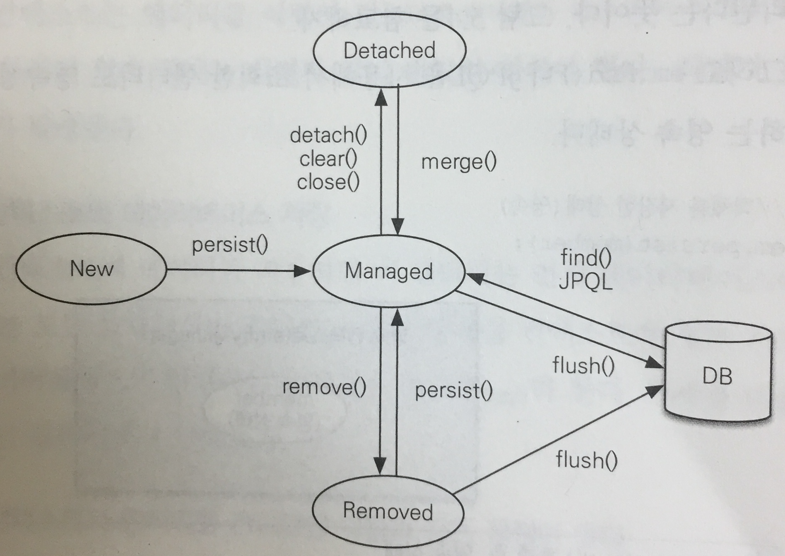

# 03. 영속성 관리

## 목차
1. 엔티티 매니저 팩토리와 엔티티 매니저
2. 영속성 컨텍스트란?
3. 엔티티의 생명주기
4. 영속성 컨텍스트의 특징
5. 플러시
6. 준영속


## 1. 엔티티 매니저 팩토리와 엔티티 매니저
```java
// 많은 비용 발생
EntityManagerFactory emf = 
    Persistance.createEntityManagerFactory("jpabook");

// 비용이 거의 안듬
EntityManager em = emf.createManager();
```

> `EntityManagerFactory` 는 `EntityManager`를  만드는 공장.
> 비용이 상당히 크기 때문에 **한 개만 만들어서** 애플리케이션 전체에 공유하도록 설계 됨.

> 그리고, `EntityManagerFactory` 는 여러 Thread-safe. 하지만 `EntityManager` 는 동시성 문제 발생으로 Non-thread-safe

## 2. 영속성 컨텍스트(Persistence Context)란?
엔티티를 **영구 저장하는 환경**
```java
// EntityManager를 이용해서 회원 엔티티를 영속성 컨텍스트에 저장
em.persist(member);
```

## 3. 엔티티의 생명주기
| 상태                     | 설명                      |
| ---------------------- | ----------------------- |
| __비영속__(new/transient) | 영속성 컨텍스트와 전혀 관계가 없는 상태  |
| __영속__(managed)        | 영속성 컨텍스트에 저장된 상태        |
| __준영속__(detached)      | 영속성 컨텍스트에 저장되었다가 분리된 상태 |
| __삭제__(removed)        | 삭제된 상태                  |


#### 비영속
```java
// 객체를 생성한 상태(비영속)
Member member = new Member();
member.setId("greenb");
member.setUsername("그린비");
```

#### 영속
`EntityManager.persist()` 를 통해서 영속성 컨텍스트에 저장.
```java
// 객체를 저장한 상태(영속)
em.persist(member);
```

#### 준영속
"영속" 상태의 엔티티를 관리자하지 않는 것(=분리하는 것).
```java
// 회원 엔티티를 영속성 컨텍스트에서 분리(준영속)
em.detach(member);
```

#### 삭제
엔티티를 **영속성 컨텍스트**와 **RDB**에서 삭제.
```java
// 객체를 삭제
em.remove(member);
```

## 4. 영속성 컨텍스트의 특징
- 영속성 컨텍스트와 식별자 값
  - 영속성 컨텍스트는 엔티티를 구별할 때 식별자 값 이용 `@Id` 
  - 반드시 있어야함. 없으면 Exception!
- 영속성 컨텍스트와 RDB 저장
  - JPA는 보통 `트랜잭션 커밋` 순간에 영속성 컨텍스트에서 RDB에 반영
  - 이것을 `flush` 라고 함
- 영속성 컨텍스트가 엔티티를 관리하면서 발생하는 이점
  - 1차 캐시
  - 동일성 보장 (같은 객체 반환 ;메모리 주소가 같은)
  - 트랜잭션을 지원하는 쓰기 지연
  - 변경 감지
  - 지연 로딩

### 4.1 엔티티 조회
```java
// 엔티티 객체를 생성한 상태(비영속)
Member member = new Member();
member.setId("greenb");
member.setUsername("그린비");

// 엔티티 객체를 영속
em.persist(member);
```
**1차 캐시**의 키는 ***식별자 값***. 그리고 RDB의 기본 키(Primary Key)와 매핑되어 있음.

```java
// 엔티티를 조회
Member member = em.find(Member.class, "greenb");
```
```java
// EntityManager.find() 명세
public <T> find(Class<T> entityClass, Object primaryKey);
```

`em.find()` 를 호출하면, 1차 캐시에서 엔티티를 조회.  
만약 찾는 엔티티가 없으면 RDB에서 조회.
```java
Member member = new Member();
member.setId("greenb");
member.setUsername("그린비");

// 1차 캐시에 저장
em.persist(member);

// 1차 캐시에서 조회
Member a = em.find(Member.class, "greenb");
Member b = em.find(Member.class, "greenb");

System.out.println(a == b); // true
```
### 4.2 엔티티 등록
```java
EntityManager em = emf.createEntityManager();
EntityTransaction tx = em.getTransaction();

// EntityManager 는 데이터 변경 시 트랜잭션을 시작
tx.begin();

em.persist(memberA);
em.persist(memberB); // 아직 RDB에 INSERT 안하고 있음

tx.commit(); // 지금 이 순간~🎵, RDB에 INSERT 함
```
`EntityManager` 는 "내부 쿼리 저장소"에 INSERT SQL을 모아둠.  
그리고 트랜잭션이 커밋될 때 모아둔 쿼리를 한꺼번에 RDB로 보냄.
이것이 트랜잭션을 지원하는 쓰기 지연 *transactional write-behind* 이라 함.

### 4.3 엔티티 수정
> 책에서는 `JPA의 기본 전략은 엔티티의 모든 필드를 업데이트한다` 라고 했는데, 최근 버전(hibernate 5.4.1) 에서는 "변경 감지"(dirty checking)를 통해 **바뀐 필드만 업데이트** 해요.

### 4.4 엔티티 삭제
```java
Member member = em.find(Member.class, "greenb");
em.remove(member);
```
엔티티를 바로 삭제하지 않고 트랜잭션 커밋으로 플러시를 호출해서 RDB에 DELETE SQL을 실행한다.

## 5. 플러시
플러시(flush()) 는 영속성 컨텍스트의 변경 내용을 RDB에 반영함.  
구체적으로 하는 일은,
1. 변경 감지를 실행하고, 수정 쿼리를 만들어 "쓰기 지연 저장소"에 등록
2. 쓰기 지연 저장소의 SQL을 RDB에 전송

영속성 컨텍스트를 플러시 하는 방법은 3가지
- `em.flush()` 를 직접 호출
- 트랜잭션 커밋 (자동으로 호출)
- JPQL 쿼리 실행 (자동으로 호출)

### 5.1 플러시 모드 옵션
엔티티 매니저에 플러시 모드를 직접 지정하려면 `javax.persistence.FlushModeType` 을 사용
  - `FlushModeType.AUTO` 커밋이나 쿼리를 실행할 때 플러시 (기본값)
  - `FlushModeType.COMMIT` 커밋할 때만 플러시

대부분 기본 설정 값인 AUTO 를 사용한다함.

## 6. 준영속
준영속 상태의 엔티티는 영속성 컨텍스트가 제공하는 기능을 사용할 수 없음.
영속 상태의 엔티티를 준영속 상태로 바꾸는 방법 3가지
- `em.detach(entity)` 특정 엔티티만 준영속 상태로 전환
- `em.clear()` 영속성 컨텍스트를 완전히 초기화
- `em.close()` 영속성 컨텍스트를 종료

### 6.1 특정 엔티티를 준영송 상태로 전환 detach()
```java
Member member = new Member();
member.setId("greenb");
member.setAge(19);

// 엔티티를 영속상태로 만듬
em.persist(member);

// 엔티티를 영속성 컨텍스트에서 분리
em.detach(member);

tx.close(); // 트랜잭션 종료
```
`detach(member)` 를 실행해서 "1차 캐시", "쓰기 지연 저장소" 모두에서 삭제  
트랜잭션이 종료되어도 RDB에 SQL이 실행되지 않음.

### 6.2 영속성 컨텍스트 초기화 clear()
```java
// 엔티티 조회. 영속 상태
Member member = em.find(Member.class, "greenb");

// 영속성 컨텍스트 초기화
em.clear();

// 엔티티 수정
member.setId("blue-c");

tx.close(); // 트랜잭션 종료
```
아무일도 없음.

### 6.3 영속성 컨텍스트 종료 close()
그냥 영속성 컨텍스트를 종료하는 것.  
굳이 코드로 설명할 내용이 없음. 그냥 `em.close()` 호출.

### 6.4 병합 merge()
준영속 상태의 엔티티를 다시 영속 상태로 변경하려는 경우 사용.  
준영속 상태의 엔티티를 받아서 그 정보로 ***새로운 영속 상태의 엔티티를 반환.***
```java
final Member member = new Member("red-a", 13);
em.persist(member);
em.flush();

//새로운 엔티티 매니저를 생성해서 사용
// EntityManager newEm = ...

final EntityTransaction tx = newEm.getTransaction();
final String name = "blue-c";

tx.begin();

member.setName(name);
final Member mergeMember = newEm.merge(member);

tx.commit();
```


소스 참고