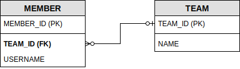

# 연관관계 매핑 기초
**객체의 참조**와 **테이블의 외래 키를 매핑**해봐요!
- **방향 direction** 단방향, 양방향이 있어요. 객체는 참조에 따라 방향이 있지만, 테이블 관계는 항상 양방향이래요.
- **다중성 multiplicity** 다대일(N:1), 일대다(1:N), 일대일(1:1), 다대다(N:M) 인 다중성이 있대요.
- **연관관계의 주인 owner** 객체가 양방향 연관관계라면 주인을 정해야한대요.

## 1. 단방향 연관관계
다대일 단방향 관계를 알아보자네요.
  > 회원과 팀이 있고  
  > 회원은 하나의 팀에만  소속될 수 있다면  
  > 회원과 팀은 다대일 관계!

#### 객체의 연관관계

- 회원 객체는 `Member.team` 필드로 팀 객체와 연관관계 맺어요.
- 회원 객체와 팀 객체는 단방향 관계라 한대요. 회원은 `Member.team` 필드로 팀을 알수 있지만, 팀은 회원을 알 수 없으니까요.  

#### 테이블의 연관관계

- 회원 테이블은 `TEAM_ID` 외래 키로 팀 테이블과 연관관계를 맺어요.
- 회원 테이블과 팀테이블은 양방향 관계라네요. 회원 테이블의 `TEAM_ID` 외래 키를 통해서 회원과 팀을 조인 할 수 있고, 반대로 팀과 회원도 조인할 수 있으니까요.

다음 이건 회원과 팀을 조인하는 SQL
```sql
  SELECT *
    FROM MEMBER M
    JOIN TEAM T
      ON M.TEAM_ID = T.TEAM_ID
```
그리고 이건 반대로 팀과 회원을 조인하는 SQL
```sql
  SELECT *
    FROM TEAM T
    JOIN MEMBER M
      ON T.TEAM_ID = M.TEAM_ID
```

#### 객체 그리고 테이블. 이들의 연관관계의 가장 큰 차이
객체가 참조를 통해 연관관계를 맺으니까 **두 객체간의 연관관계는 서로 다른 2개의 단방향 관계를 통해서 양방향 처럼 만들어요.**  
하지만 테이블은 외래 키 하나로 양방향을 만들 수 있어요.
```java
// 이건 단방향 이고요.
class ObjectA {
  ObjectB objB;
}
```
```java
// 이건 양방향 이에요.
class ObjectA {
  ObjectB objB;
}

class ObjectB {
  ObjectA objA;
}
```
정리하자면, **객체를 양방향 참조하려면 단방향 연관관계를 2개 만든다**는 거죠.

### 1.1 순수한 객체 연관관계
딱히 적지 않아도 이전 설명으로 충분히 전달된 내용이라 안 적어요.

### 1.2 테이블 연관관계
이것도 역시 설명을 한번 더 상기하는 내용들이어서 그냥 건너뛰어요.

### 1.3 객체 관계 매핑
드디어 매핑을 해보네요. 역시 코드가 좋네요.  
```java
@Entity
class Member {
  @Id
  @Column(name = "MEMBER_ID")
  private Long id;
  private String username;

  // 연관관계 매핑
  @ManyToOne // 관계 매핑을 위해 이건 필수여야 한대요.
  @JoinColumn(name = "TEAM_ID") // 이건 생략 가능하대요.
  private Team team;

  // 연관관계 설정
  public void setTeam(Team team) {
    this.team = team;
  }

  ...
}
```
```java
@Entity
class Team {
  @Id
  @Column(name = "TEAM_ID")
  private Long id;
  private String name;

  ...
}
```

### 1.4 @JoinColumn
| 속성                                                               | 기능                       | 기본 값                           |
| ---------------------------------------------------------------- | ------------------------ | ------------------------------ |
| name                                                             | 매핑할 외래 키 이름              | "{필드 이름}_{참조 테이블의 기본 키 컬럼 이름}" |
| referencedColumnName                                             | 외래 키가 참조하는 대상 테이블의 컬럼 이름 | 참조하는 테이블의 기본 키 컬럼 명            |
| foreignKey                                                       | DDL 전용. 외래 키 제약조건을 직접 지정 |                                |
| unique, nullable, insertable, updatable, columnDefinition, table | @Column 속성과 같음           |                                |

> ***@JoinColumn 생략***
> 생략 가능하댔는데, 그러면 외래 키를 찾을 때 기본 전략을 쓴대요.  
> i.e. {필드명;**team**} + "**_**" + {참조하는 테이블의 컬럼 이름;**TEAM_ID**} = "**team_TEAM_ID**"

### 1.5 @ManyToOne
| 속성       | 기능                              | 기본 값                                                          |
| -------- | ------------------------------- | ------------------------------------------------------------- |
| optional | 연관된 엔티티가 없어도 됨. false 면 꼭 있어야 함 | true                                                          |
| fetch    | 글로벌 페치 전략을 설정(뭔말?)              | @ManyToOne = FetchType.EAGER <br> @OneToMany = FetchType.LAZY |
| cascade  | 영속성 전이 기능을 사용(뭔말?)              |                                                               |


> 다대일 `@ManyToOne` 과 비슷한 일대일 `@OneToOne` 관계도 있대요. 단방향 관계를 매핑할 때 둘중 어떤것을 사용할 지는 반대편 관계에 달려 있고요. 그니깐 `Team` 클래스에서 `List<Member> members` 이런 필드면 다대일, `Member member` 이런 필드면 일대일 이란 말인가 봐요.

<br>

## 2. 연관관계 사용
CRUD 에 연관관계를 어떻게 사용하는지 알아봐요.
### 2.1 저장
```java
public void save() {
  // save to "Team 1"
  Team team1 = new Team(1L, "Team 1st");
  em.persist(team1);

  // save to "Member 1"
  Member member1 = new Member(1L, "Member 1st");
  member1.setTeam(team1);
  em.persist(member1);

  // save to "Member 2"
  Member member2 = new Member(2L, "Member 2nd");
  member2.setTeam(team1);
  em.persist(member2);
}
```
> ⚠️ ***WARNKING***  
> 엔티티를 저장할 때 연관된 모든 엔티티는 영속 상태 여아 한대요.
> 그래서 위에서도 `Team` 인스턴스를 먼저 저장했군요.

### 2.2 조회
연관관계가 있는 엔티티 조회 방법은 2가지

#### 객체 그래프 탐색
```java
Member member = em.find(Member.class, 1L);
Team team = member.getTeam() // 객체 그래프 탐색
```

#### 객체지향 쿼리(JPQL) 사용
```sql
-- JPQL
select m
  from Member m
  join m.team t
 where t.name = :teamName

-- 실행되는 SQL
  SELECT M.*
    FROM MEMBERS M
   INNER
    JOIN TEAM T
      ON M.TEAM_ID = T.ID
   WHERE T.NAME = :teamName
```

### 2.3 수정
테스트 코드에 있어서 그냥 그걸 보는 걸로 해요.

### 2.4 연관관계 제거
```java
Member member = em.find(Member.class, 1L);
member.setTeam(null); // 연관관계 제거
```

### 2.5 연관된 엔티티 삭제
외래 키 제약조건에 의해서 **연관관계 끊은 후 삭제**를 해야합니다.
```java
member1.setTeam(null);
member2.setTeam(null);
emremove(team);
```

<br>

## 3. 양방향 연관관계

`Team.member` 필드가 추가됐어요.
연관 관계를 다시 정리하면.
- 회원 ---> 티임 (Member.team)
- 티임 ---> 회원 (TEam.members)
> 💬 ***참고***  
> JPA는 JCF(Collection, Set, Map 같은 것들)를 지원한대요.

테이블 관계는 따로 해줄게 없이 그냥 양방향이란거 앞에서 얘기했죠.

### 3.1 양방향 연관관계 매핑
```java
@Entity
class Team {
  @Id
  @Column(name = "TEAM_ID")
  private Long id;
  private String name;

  // 이게 추가 됐어요.
  @OneToMany(mappedBy = "team")
  private List<Member> members = new ArrayList<>();
}
```
`@OneToMany` 를 사용했고, `mappedBy` 속성은 반대쪽 매핑의 필드 값을 줬다네요.

### 3.2 일대다 컬렉션 조회
```java
Team team = em.find(TEam.class, 1L);
List<Member> members = team.getMembers();
```

<br>

## 4. 연관관계의 주인
테이블은 외래 키 하나로 두 테이블의 연관관계를 관리.  
하지만 객체는 연관된 각각의 엔티티가 각자 참조 대상을 관리해줘야 하죠.
여기서 **객체 참조는 2개인데, 외래키는 1개인 차이**가 발생해요.  
그래서 **두 객체가 연관관계 중 하나를 정해서 테이블의 외래 키를 관리**해야 하는데 이것이 ***연관관계의 주인owner*** 라고 한대요.

### 4.1 양방향 매핑의 규칙: 연관관계의 주인
연관관계의 주인<sub>owner</sub>만이 데이터베이스 연관관계와 매핑되고 외래 키를 관리(등록, 수정, 삭제)할 수 있다고 해요. **주인이 아닌 쪽은 읽기만 가능**하고.
- 주인은 `mappedBy` 를 사용하지 않는대요.
- 주인이 아니면 `mappedBy` 를 써서, 연관관계의 주인을 지정해줘야 한대요.

#### 회원 ---> 팀(Member.team) 방향
```java
class Member {
  ...

  @ManyToOne
  @JoinColumn(name = "TEAM_ID")
  private Team team;

  ...
}
```
#### 팀 ---> 회원(Team.members) 방향
```java
class Team {
  ...

  @OneToMany(mappedBy = "team")
  List<Member> members = new ArrayList<>();

  ...
}
```
"연관관계의 주인을 정한다"는 것은 사실 **외래 키 관리자를 선택하는 것**!

### 4.2 연관관계의 주인은 외래 키가 있는 곳
별다른 얘기가는 없어요. 그냥 `mappedBy` 를 적절하게 사용하라는 얘기죠.

## 5. 양방향 연관관계 저장
단방향 저장할 때랑 똑같아요. 뭐, 당연한 것도 같네요.

## 6. 양방향 연관관계의 주의점
흔히 하는 실수래요. "실수"라기 보다는 모르기 때문에 이렇게 하는 것 같아요.

```java
Member member1 = new Member(1L, "Member 1st");
em.persit(member1);

Member member2 = new Member(2L, "Member 2nd");
em.persist(member2);

Team team1 = new Team(1L, "Team 1st");

// 주인이 아닌 곳에 연관관계를 설정하네요. ❌
List<Member> members = team1.getMembers();
members.add(member1);
members.add(member2);

em.persist(team1);
```
