# 다양한 연관관계 매핑
엔티티의 연관관계를 매핑할 때 고려할게,
1. 다중성
2. 단방향, 양방향
3. 연관관계의 주인

#### 다중성
- 다대일(@ManyToOne)
- 일대다(@OneToMany)
- 일대일(@OneToOne)
- 다대다(@ManyToMany)

#### 단방향, 양방향
객체는 참조용 필드를 가지고 연관된 객체를 조회하죠. 서로가 참조하면 양방향, 한쪽에서만 참조되면 단방향이겠죠.

#### 연관관계의 주인
테이블간의 외래 키를 관리하는 녀석이 연관관계의 주인이에요. `mappedBy` 를 쓰지 않은 참조 필드(메소드)가 주인인 거죠.

## 1. 다대일
DB 테이블간의 `일(1)` 과 `다(N)` 관계에서 외래 키는 항상 `다(N)` 쪽에 있대요.

### 1.1 다대일 단방향(N:1)

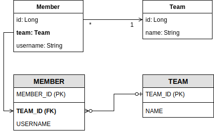

```java
class Member {
  ...

  @ManyToOne
  @JoinColumn(name = "TEAM_ID")
  private Team team;

  ...
}
```
`Member.team` 필드로 `MEMBER` 테이블의 `TEAM_ID 외래 키` 를 관리 하는거죠.

### 1.2 다대일 양방향 (N:1, 1:N)

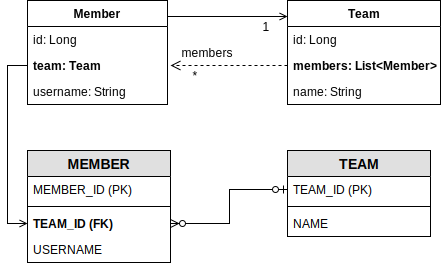

```java
@Entity
class Member {
  @Id @GeneratedValue
  @Column(name = "MEMBER_ID")
  private Long id;

  @ManyToOne
  @JoinColumn(name = "TEAM_ID")
  private Team team;

  public void setTeam(Team team) {
    this.team = team;

    // 무한루프에 빠지지 않도록 체크(뭔말?)
    if (!team.getMembers().contains(this))
      team.getMembers().add(this);
  }

  ...
}
```

```java
@Entity
class Team {
  @Id @GeneratedValue
  @Column(name = "TEAM_ID")
  private Long id;

  @OneToMany(mappedBy = "team")
  private List<Member> members = new ArrayList<>();

  public void addMember(Member member) {
    this.members.add(member);

    // 무한루프에 빠지지 않도록 체크
    if (member.getTeam() != this)
      member.setTeam(this);
  }
}
```

#### 양방향은 외래 키가 있는 쪽이 *연관관계의 주인* 이다.
`Member.team` 필드가 연관관계 주인, `Team.members` 는 조회 할때만 쓰는 아이.

#### 양방향 연관관계는 항상 서로를 참조해야 한다.
항상 서로 참조하게 하려면 연관관계 편의 메소드를 작성하는게 좋다네요.  
`Member.setTeam(...)`, `Team.addMember(...)` 같은 거.
근데 여기서 무한루프에 빠지니까 주의하래요. 어떡하면 무한루프죠?!

<br>

## 2. 일대다
다대일의 반대. 엔티티가 하나 이상 참조 할 수 있어야 하니까, Java Collection `Collection, List, Set, Map` 중에서 선택해서 사용해야 된대요.

### 2.1 일대다 단방향(1:N)


`Team.members` 로 `MEMBER` 테이블의 `TEAM_ID` 외래 키를 관리하게 되네요. 좀 이상해 보이긴 해요.
```java
@Entity
class Team {
  ...

  @OneToMany
  @JoinColumn(name = "TEAM_ID") // MEMBER 테이블의 TEAM_ID(FK), 지금 여긴 Team 엔티틴데...
  private List<Member> members = new ArrayList<>();

  ...
}
```
성능 및 관리 포인트 등 단점이 많다고 하네요. 어차피 DB 테이블상의 관계는 똑같고 엔티티 정의만 잘 하면 되는 부분이니까 가능하면 **일대다 단방향 매핑보다 다대일 양방향 매핑을 사용**하자네요.  
(저자는 권장을 하면서도 상황에 따라 다른 부분이 있을 수 있다고 했는데, 얼핏 생각되는 경우가 없어서... 같이 얘기해봐요.)

### 2.2 일대다 양방향 (1:N, N:1)
일대다 양방향 매핑은 존재하지 않는대요. 그렇다면 왜 이번 단락을 만들었을까요? 다대일 양방향 매핑을 대신 사용한대요. 어찌됐건 둘다 같은 말이라는데... 일단 더 보시죠.


```java
@Entity
class Team {
  ...

  @OneToMany
  @JoinColumn(name = "TEAM_ID")
  private List<Member> members = new ArrayList<>();

  ...
}
```
```java
@Entity
class Member {
  ...

  @ManyToOne
  @JoinColumn(name = "TEAM_ID", insertable = false, updatable= false)
  private Team team;

  ...
}
```
이렇게 엔티티 매핑을 하게 되는데, 문제는 **둘다 같은 외래키 키를 관리**하게 되는거에요. 그래서 `insertable = false, updatable = false` 를 설정해서 **다대일 쪽은 읽기만 가능**하게 해줘야 하죠.

## 3. 일대일(1:1)
- 일대일 관계는 반대도 일대일 관계
- 일대일 관계는 둘 중 아무곳에서나 외래 키를 가짐

### 3.1 주 테이블에 외래 키 

#### 단방향


```java
@Entity
class Member {
  ...

  @OneToOne
  @JoinColumn(name = "LOCKER_ID")
  private Locker locker;

  ...
}
```
```java
@Entity
class Locker {
  @Id @GeneratedValue
  @Column(name = "LOCKER_ID")
  private Long id;
  private String name;

  ...
}
```

#### 양방향


```java
@Entity
class Member {
  ...

  @OneToOne
  @JoinColumn(name = "LOCKER_ID")
  private Locker locker;

  ...
}
```
```java
@Entity
class Locker {
  ...

  @OneToOne(mappedBy = "locker")
  private Member member;

  ...
}
```
`Locker.member` 는 연관관계의 주인이 아니라고 `@OneToOne(mappedBy = "locker")` 이렇게 설정해줬네요.


### 3.2 대상 테이블에 외래 키

#### 단방향
JPA는 이런거는 지원 안한대요. 생각해봐도 안되는게 맞는것 같고요.

#### 양방향


```java
@Entity
class Member {
  ...

  @OneToOne(mappedBy= "member")
  private Locker locker;

  ...
}
```
```java
@Entity
class Locker {
  ...

  @OneToOne
  @JoinColumn(name = "MEMBER_ID")
  private Member member;


  ...
}
```

`Locker.member` 가 연관관계의 주인.


## 4. 다대다 (N:N)
RDBMS에서는  테이블 2개로 다대다 관계를 표현 할 수 없대요. 

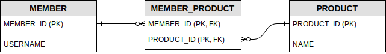

그래서 중간에 연결테이블을 두고 일대다와 다대일 관계로 사용한다네요.
하지만 객체는 2개로 다대다 관계를 만들 수 있다죠.

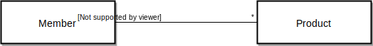

`@ManyToMany` 를 사용해서 다대다 관계를 편리하게 매핑할 수 있대요. (뒤를 살짝 봤는데 그렇게 편하진 않은듯.)

### 4.1 다대다 단방향

```java
@Entity
class Member {
  ...

  @ManyToMany
  @JoinTable(
    name = "MEMBER_PRODUCT",
    joinColumns = @JoinColumn(name = "MEMBER_ID"),
    inverseJoinColumns = @JoinColumn(name = "PRODUCT_ID")
  )
  private List<Product> products = new ArrayList<Product>();

  ...
}
```

```java
@Entity
class Product {
  @Id
  @Column(name = "PRODUCT_ID")
  private String id;

  ...
}
```

`@ManyToMany` 와 `@JoinTable` 을 사용해서 연결 테이블을 바로 매핑한대요.
속성들 정리를 해보면.
| 속성                 | 설명                             |
| ------------------ | ------------------------------ |
| name               | 연결 테이블을 지정                     |
| joinColumns        | 현재 방향(?)인 회원과 매핑할 조인 컬럼 정보를 지정 |
| inverseJoinColumns | 반대 방향인 상품과 매핑할 조인 컬럼 정보를 지정    |

뭐, 딱 봐도 직관적으로 알꺼 같긴 하네요.
엔티티를 저장할 때는.
```java
void save() {
  Product product = new Product();
  product.setId("product-a");
  product.setName("상품A");
  em.persist(product);

  Member member = new Member();
  member.setId("member1");
  member.setUsername("나회원");
  member.setProducts().add(product); // 연관관계 설정
  em.persist(member);
}
```
역시 저장하는 코드도 평이하군요.  
객체 그래프 탐색으로 조회하고 실행 SQL이 나오는 내용은 생략할게요.

### 4.2 다대다 양방향

`@ManyToMany` 를 썼는데 역방향 에도 쓰면 된대요. 물론 속성의 `mappedBy` 를 지정해 주고요.
```java
@Entity
class Product {
  ...

  @ManyToMany(mappedBy = "products") // 역방향 연관관계 추가
  private List<Member> members;

  ...
}
```

### 4.3 다대다: 매핑의 한계와 극복, 연결 엔티티 사용

`@ManyToMany` 는 연결 테이블과 매핑을 자동으로 처리하고 도메인 모델도 깔끔해지는 등 여러모로 편리하대요. 그렇지만 이런 단순함이 실무엔 없을거라고 😱  

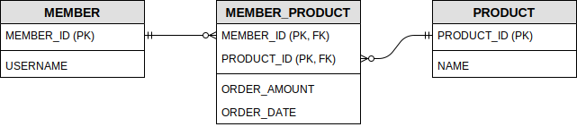

이렇게 연결 테이블에 추가된 컬럼을 `@JoinTable` 로는 감당할 수 없는 거겠죠.  
객체 연관관계를 바꿔서 극복해보아요 🤔

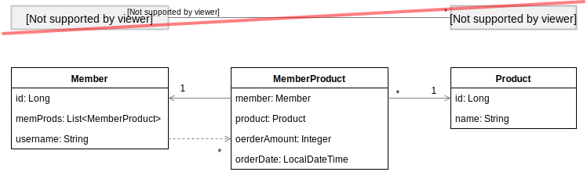

연결 테이블도 엔티티를 만들어 매핑하고, 기존에 다대다 였던 걸 일대다, 다대일로 변경 해줘야 하겠군요.
```java
@Entity
class Member {
  ...

  @OneToMany(mappedBy = "member")
  private List<MemberProduct> memProds;

  ...
}
```
```java
@Entity
class Product {
  @Id
  @Column(name = "PRODUCT_ID")
  private Long id;
  private String name;

  ...
}
```
```java
@Entity
@IdClass(MemberProductID.class) // "복합 기본 키" 를 처리
class MemberProduct {
  @Id
  @ManyToOne
  @JoinColumn(name = "MEMBER_ID")
  private Member member;

  @Id
  @ManyToOne
  @JoinColumn(name = "PRODUCT_ID")
  private Product product;

  private Integer orderAmount;
  private LocalDateTime orderDateTime;

  ...
}
```
```java
public class MemberProductID implements Serializable {
  private Long memberId;
  private Long productId;

  @Override
  public boolean equals(Object o) {
    if (o == this) return true;
    if (!(o instanceof MemberProductId)) return false;

    MemberProductId instance = (MemberProductId) o;
    return instance.memberId == memberId
        && instance.productId == productId;
  }

  @Override
  public int hashCode() {
    int hash = 1;
    hash *= 17 + memberId == null ? 0 : memberId;
    hash *= 17 + productId == null ? 0 : productId;
    return hash;
  }
}
```
별건 아니군요.
오히려 "복합 기본 키" 라는 개념이 나와서 생소한 듯 하니까 정리해 볼까요.
- 복합 기본 키는 별도의 식별자 클래스로 만듬
- `java.lang.Serializable` 을 구현해야 함
- `Object.equals(...)` 와 `Object.hashCode()` 를 구현해야 함
- 기본 생성자 있어야 함
- `public` 접근자 사용해야 함


### 4.4 다대다: 새로운 기본 키 사용
저자가 추천하는 기본 생성 전략은 DB에서 자동 생성되는 대리 키(`AUTO_INCREMENT` 또는 `SEQUENCE`)를 사용하는 거래요. 장점으로는 거의 영구적으로 쓰고, 비지니스 로직에 의존하지 않는다네요. 가장 좋은 장점은 이전 처럼 "복합 기본 키"가 없어 매핑이 간결해 진다는 점 🤟

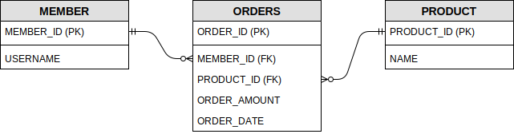

테이블 명칭도 바꿨어요. `MEMBER_PRODUCT` 에서 `OTHERS` 로.  
다른 "식별관계"도 조금 바꼈죠.

```java
@Entity
@Table(name = "ORDERS") // DB syntax 의 예약어로 "ORDER" 가 있어서...
class Order {
  @Id @GeneratedValue
  @Column(name = "ORDER_ID")
  private Long id;

  @ManyToOne
  @JoinColumn(name = "MEMBER_ID")
  private Member member;

  @ManyToOne
  @JoinColumn(name = "PRODUCT_ID")
  private Product product;

  ...
}
```
```java
@Entity
class Member {
  ...

  @OneToMany(mappedBy = "member")
  private List<Order> orders = new ArrayList<>();

  ...
}
```
```java
@Entity
class Product {
  @Id
  @Column(name = "PRODUCT_ID")
  private Long id;
  private  String name;

  ...
}
```
대리키를 사용하면서 매핑이 간결해지고 이해하기 편해졌다고 저자께서 말씀하셨다.

---
참조자료
 - [차트](https://drive.google.com/file/d/14Ydy1eNT8Z5W2MI82RkcARZWhrFA6FQh/view?usp=sharing)