# 고급 매핑

## 1. 상속 관계 매핑

RDBMS에는 상속이라는 개념이 없죠.  
대신, "슈퍼 타입 서브 타입 관계<sub>Super-Type Sub-Type Relationship</sub>" 라는 모델링 기법이 상속 개념과 유사하다네요.
왼쪽이 RDBMS의 논리 모델이고 오른쪽은 Class-Diagram 입니다.  
그림으로 보니까 좀 유사한듯 하네요.

논리 모델을 물리 모델로 구현하는 방법으로 3가지를 소개했네요. 알아봅시다.

### 1.1 조인 전략

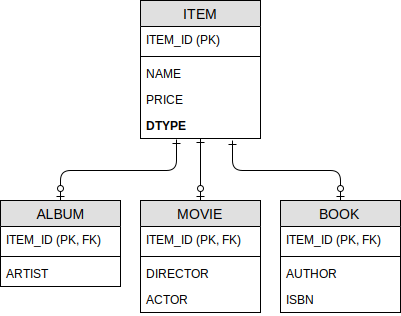
요소들을 각각의 테이블로 만들죠. 직관적이네요. 하지만 테이블이 데이터의 타입을 구분지어주지는 못하니까 `DTYPE` 컬럼을 사용해야 겠네요.

```java
@Entity
@Inheritance(strategy = InherianceType.JOINED)
@DiscriminatorColumn(name = "DTYPE")
abstract class Item {
  @Id @GeneratedValue
  @Column(name = "ITEM_ID")
  private Long id;

  private String name;
  private Integer price;
  ...
}
```

```java
@Entity
@DiscrimatorValue("A")
class Album extends Item {
  private String artist;
  ...
}
```

```java
@Entity
@DiscriminatorValue("M")
class Movie extends Item {
  private String director;
  private String actor;
  ...
}
```

만약 서브타입 테이블의 기본키(PK, FK가 걸려있는) 컬럼명이 슈퍼타입과 다르다면 `@PrimaryKeyJoinColumn` 을 쓰면 된대요.

```java
@Entity
@DiscriminatorValue("B")
@PrimaryKeyJoinColumn(name = "BOOK_ID")
class Book extends Item {
  private String author;
  private String isbn;
  ...
}
```

---

"조인 전략"의 장단점을 정리해보면,

- 장점
  - 테이블 정규화
  - 외래 키가 가진 "참조 무결성 제약조건" 활용
  - 저장 공간의 효율성 (용량 신경쓰는 세상이 아닌듯 한데, 일단 책에 그렇다하니...)
- 단점
  - 조회하면 join query 때문에 성능 저하
  - 조회 쿼리의 복잡도
  - 데이터를 저장할 때 2개의 테이블에 INSERT

 <br>
 
### 1.2 단일 테이블 전략
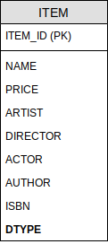  
별거 없이 그냥 테이블에 여러 컬럼을 만들고 구겨 넣네요.  
상남자같네, 내 스타일이야~😍
```java
@Entity
@Inhieritance(strategy = InheritanceType.SINGLE_TABLE)
@DiscriminatorColumn(name = "DTYPE")
abstract class Item {
  @Id @GeneratedValue
  @Column(name = "ITEM_ID")
  private Long id

private String name;
private Integer price;
...
}

````
```java
@Entity
@DiscriminatorValue("A")
class Album extends Item {}
````

구분 값 때문에 어쨌든 `abstract class` 를 만들고, `sub class` 를 만들어야 하는 군요.  
`@DiscriminatorColumn` 은 꼭 정의 해야만 하고, `sub class` 에 `@DiscriminatorValue` 를 지정하지 않으면 기본으로 **"엔티티 이름" 이 사용** 된대요.

장단점은,

- 장점
  - join이 없어서 일반적으로 빠르다는군요.
  - 조회 쿼리도 단순하고.
- 단점
  - 세부 속성을 저장하는 컬럼들이 nullable 이어야만 하고
  - 하나에 다 때려 넣으므로 데이터가 클 경우에 오히려 성능 저하..😰

<br>

### 1.3 구현 클래스마다 테이블 전략

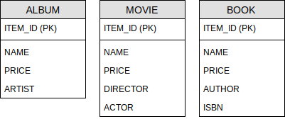  
상속 구조를 따르지 않고 개별 항목별로 엔티티를 만들어요.

```java
@Entity
@Inheritance(strategy = InheritanceType.TABLE_PER_CLASS)
abstract class Item {
  @Id @GeneratedValue
  @Column(name = "ITEM_ID")
  private Long id;

  private String name;
  private Integer price;
  ...
}
```

그래도 엔티티는 상속 구조로 해야죠. `@Discriminator~` 같은건 쓸모 없겠네요.

```java
@Entity
class Album extends Item {
  private String artist;
  ...
}
```

```java
@Entity
class Movie extends Item {
  private String director;
  private String actor;
  ...
}
```

책에서도 비추라고 하네요.🤪

- 장점
  - 서브 타입을 구분해서 처리할 때, 효과적(?)
  - `not null` 제약조건 사용 가능
- 단점
  - 항목들을 동시에 조회할 때 성능 느림 (UNION SQL 사용)
  - 통합해서 쿼리하기 힘들대요.

## 2. @MappedSuperclass

`sub class` 에게 `super class` 의 매핑 정보만 주고 싶다면 이걸 쓰래요.

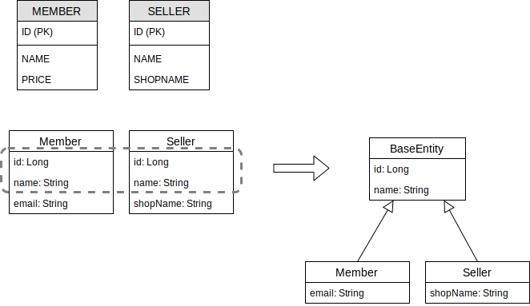  
`MEMBER` 와 `SELLER` 라는 비슷한 속성의 테이블이 있을 때 저렇게 엔티티를 만들고, 두 엔티티의 동일한 속성을 `BaseEntity` 로 만들어서 상속 받는 구조로 만드네요.

```java
@MappedSuperclass
abstract class BaseEntity {
  @Id @GeneratedValue
  private Long id;
  private String name;
  ...
}
```

```java
@Entity
class Member extends BaseEntity {
  private String email;
  ...
}
```

<br>

`Super class` 에서 내려온 매핑을 재정의 하려면 `@AttributeOverride(s)` 를 사용하고요.

```java
@Entity
@AttributeOverrides({
  @AttributeOveride(name = "id", column = @Column(name = "MEMBER_ID"))
})
class Member extends BaseEntity {
  private String email;
}
```

연관 관계를 재정의 하려면 `@AssociationOverride(s)` 를 사용 한대요. (책에 예제가 없어서 코드는 없음. 획일적이고 단편적인 인간🥵)

`@MappedSuperclass` 특징은

- 테이블과 직접적으로 매핑되는게 아님
- 엔티티가 아니라는 거~
- `abstract class` 로 정의하라고 권장 (뭐, 하긴 단독 플레이 할 경우가 없을 듯)

<br>

## 3. 복합 키와 식별 관계 매핑

### 3.1 식별 관계 vs 비식별 관계

**식별관계** 란, 부모 테이블의 기본 키를 내려 받아서 **_자식 테이블의 기본 키 + 외래 키로 사용_** 하는 관계  
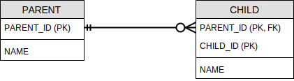

**비식별 관계** 란, 부모 테이블에서 기본 키를 내려 받지만 **_자식 테이블에서 외래 키_** 로만 사용하는 관계  
  
**필수적 비식별 관계** 는 외래 키에 NULL을 허용하지 않아 꼭 관계를 맺어야💕 하고, **선택적 비식별 관계** 는 ~~서로 매력을 덜 느꼈는지~~ 관계를 맺을지 말지...

### 3.2 복합 키: 비식별 관계 매핑

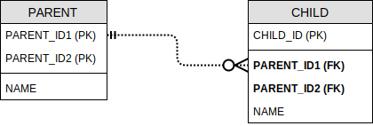

```java
@Entity
@IdClass(ParentId.class)
class Parent {
  @Id
  @Column(name = "PARENT_ID1")
  private Long id1;

  @Id
  @Column(name = "PARENT_ID2")
  private Long id2;

  private String name;
  ...
}
```

복합 키로 구성된 `Parent` 엔티티는 `@IdClass` 를 사용했네요.

```java
@EqualsAndHashCode
public class ParentId implements Serialization {
  private Long id1;
  private Long id2;
  ...
}
```

기억나시나요? `@IdClass` 는 `Serialization`, `equals()`, `hashCode()` 을 구현해야 하고, 기본 생성자 있어야하고 등등..
아참, 제일 중요한 거.  
`@IdClass` 의 필드 명칭과 사용하는 엔티티의 `@Id` 필드 명칭과 같아야 한다는 거.
실제로 엔티티를 저장할 때는

```java
Parent p = new Parent();
p.setId("myId1"); // 식별자1
p.setId("myId2"); // 식별자2
p.setName("lullullalla");
em.perist(p);
```

이렇게만 해도 저장될때는 `ParentId.class` 의 인스턴스가 먼저 생성되고, 거기서 생성된 식별자를 가지고 저장이 되는 방식이라니, 똑똑하네~

```java
@Entity
class Child {
  @Id
  private Long id;

  @ManyToOne
  @JoinColumns({
    @JoinColumn(name = "PARENT_ID1", referencedColumnName = "PARENT_ID1"),
    @JoinColumn(name = "PARENT_ID2", referencedColumnName = "PARENT_ID2")
  })
  private Parent parent;
  ...
}
```

자식 클래스는 엔티티를 이렇게 구성할 수 있대요.  
물론 `@JoinColumn` 의 `name` 과 `referencedColumnName` 명칭이 같을 때는 생략할 수 있대요.

<br>

`@IdClass` 가 RDBMS에 맞춘 방법이라면 @EmbeddedId 는 객체 지향적인 방법이래요.

```java
@Entity
class Parent {
  @EmbeddedId
  private ParentId id;
  private String name;
  ...
}
```

이렇게 Parent 엔티티를 만들고,

```java
@Embeddable
@EqualsAndHashCode
class ParentId implements Serializable {
  @Column(name = "PARENT_ID1")
  private Long id1;

  @Column(name = "PARENT_ID2")
  private Long id2;
  ...
}
```

`@IdClass` 랑은 다르게 필드에 기본 키 컬럼을 매핑했네요. 이게 좀 좋아보이네요, 저는.  
작성 규칙은 `@IdClass` 와 같이

- 기본 생성자
- Serialization 구현
- equals, hashCode Override
- class 접근이 public

<br>

### 3.3 복합 키: 식별 관계 매핑

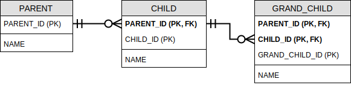  
이걸 우선 `@IdClass` 로 엔티티를 작성해 보면,

```java
@Entity
class Parent {
  @Id
  @Column(name = "PARENT_ID")
  private Long id;
  private String name;
  ...
}
```

```java
@Entity
@IdClass(ChildId.class)
class Child {
  @Id
  @ManyToOne
  @JoinColumn(name = "PARENT_ID")
  private Parent parent;

  @Id
  @Column(name = "CHILD_ID")
  private Long childId;

  private String name;
  ...
}
```

```java
@EqualsAndHashCode
public class ChildId implements Serializable {
  private Long parent; // 필드 이름이 같아야 해요!
  private Long childId;
  ...
}
```

```java
@Entity
@IdClass(GrandChildId.class)
class GrandChild {
  @Id
  @ManyToOne
  @JoinColumns({
    @JoinColumn(name = "PARENT_ID"),
    @JoinColumn(name = "CHILD_ID")
  })
  private Child child;

  @Id
  @Column(name = "GRAND_CHILD_ID")
  private Long grandChildId;

  private String name;
  ...
}
```

```java
public class GrandChildId implements Serializable {
  private ChildId child;
  priate Long grandChildId;
  ...
}
```

막상 해보니깐 생각을 좀 해야하네요.  
이번에는 `@EmbeddedId` 를 사용해서 엔티티를 구성해봐요. 전 이게 더 맘에 들었는데. Parent 엔티티는 동일 하고요.

```java
@Embeddable
public class ChildId implements Serializable {
  @Id @Column(name = "PARENT_ID")
  private Long parentId;

  @Id @Column(name = "CHILD_ID")
  private Long childId;
  ...
}
```

```java
@Entity
class Child {
  @EmbeddedId
  private ChildId id;

  @MapsId("parentId")
  @ManyToOne
  @JoinColumn(name = "PARENT_ID")
  public Parent parent;

  private String name;
  ...
}
```

```java
@Embeddable
public GrandChildId implements Serializable {
  private ChildId childId; // @MapsId 로 매핑??

  @Id @Column(name = "GRAND_CHILD_ID")
  private Long grandChildId;
  ...
}
```

```java
@Entity
class GrandChild {
  @EmbeddedId
  private GrandChildId id;

  @MapsId("childId")
  @ManyToOne
  @JoinColumns({
    @JoinColumn(name = "PARENT_ID"),
    @JoinColumn(name = "CHILD_ID")
  })
  private Child child;

  private String name;
  ...
}
```

`@EmbeddedId` 는 그냥 되는게 아니었다. `@Id` 대신해서 `@MapsId(...)` 를 사용해야 하군요.

<br>

### 3.4 비식별 관계로 구현

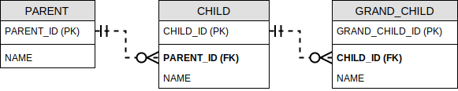  
이런 비식별 관계를 엔티티로 만들어 봅시다.

```java
@Entity
class Parent {
  @Id @Column(name = "PARENT_ID")
  private Long id;

  private String name;
  ...
}
```

```java
@Entity
class Child {
  @Id @Column(name = "CHILD_ID")
  private Long id;

  @ManyToOne
  @JoinColumn(name = "PARENT_ID")
  private Parent parent;

  private String name;
  ...
}
```

```java
class GrandChild {
  @Id @Column(name = "GRAND_CHILD_ID")
  private Long id;

  @ManyToOne
  @JoinColumn(name = "CHILD_ID")
  private Child child;

  private String name;
  ...
}
```

이건 간단하네요.

<br>

### 3.5 일대일 식별 관계

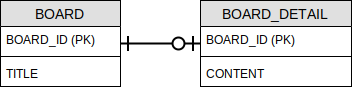  
일대일 식별 관계는 특별하대요.

```java
@Entity
class Board {
  @Id @GeneratedValue
  @Column(name = "BOARD_ID")
  private Long id;

  private String title;

  @OneToOne(mappedBy = "board")
  private BoardDetail detail;
}
```

```java
@Entity
class BoardDetail {
  @Id
  private Long id;

  private String content;

  @MapsId
  @OneToOne
  @JoinColumn(name = "BOARD_ID")
  private Board board;
}
```

이렇게 매핑한 엔티티를 저장하려면,

```java
public void save() {
  Board board = new Board();
  board.setTitle("t-i-t-l-e");
  em.persit(board);

  BoardDetail detail = new BoardDetail();
  detail.setContent("c-o-n-t-e-n-t");
  detail.setBoard(board);
  em.persist(detail);
}
```

식별과 비식별의 엔티티 매핑을 정리 하면서 장단점을 몇가지 소개 했는데, 요약하면 **_비식별 관계를 사용하고 기본 키는 Long 타입(숫자)의 대리키를 사용_** 하란 말씀!

## 4. 조인테이블

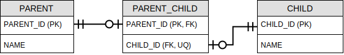

1:1 Join Table 매핑해봐요.

```java
@Entity
class Parent {
  @Id @GeneratedValue
  @Column(name = "PARENT_ID")
  private Long id;
  private String name;

  @OneToOne
  @JoinTable(
    name = "PARENT_CHILD",
    joinColumns = @JoinColumn(name = "PARENT_ID"),
    inverseJoinColumns = @JoinColumn(name = "CHILD_ID")
  )
  private Child child;
  ...
}
```

```java
@Entity
class Child {
  @Id @GeneratedValue
  @Column(name = "CHILD_ID")
  private Long id;
  private String name;
  ...
  /**
   * for bidirectional
  @OneToOne(mappedBy = "child")
  private Parent parent;
  */
}
```

### 4.2 일대다 조인 테이블

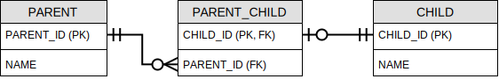

```java
@Entity
class Child {
  @Id @GeneratedValue
  @Column(name = "CHILD_ID")
  private Long id;
  private String name;
  ...
}
```

```java
@Entity
class Parent {
  @Id @GeneratedValue
  @Column(name = "PARENT_ID")
  private Long id;
  private String name;

  @OneToMany
  @JoinTable(
    name = "PARENT_CHILD",
    joinColumns = @JoinColumn(name = "PARENT_ID"),
    inverseJoinColumns = @JoinColumn(name = "CHILD_ID")
  )
  private List<Child> children = new ArrayList<>();
  ...
}
```

은근 헷갈리네요, `Child` 엔티티에서 뭔가를 해줘야 하나 싶었는데...

### 4.3 다대일 조인 테이블

일대다의 반대 방향향인거죠. 다대일, 일대다 양방향 관계로 매핑해보재요.

```java
@Entity
class Child {
  @Id @GeneratedValue
  @Column(name = "CHILD_ID")
  private Long id;
  private String name;

  @ManyToOne(optional = false) // What is optional?!
  @JoinTable(
    name = "PARENT_CHILD",
    joinColumns = @JoinColumn(name = "CHILD_ID"),
    inverseJoinColumns = @JoinColumn(name = "PARENT_ID")
  )
  private Parent parent;
}
```

```java
@Entity
class Parent {
  @Id @GeneratedValue
  @Column(name = "PARENT_ID")
  private Long id;
  private String name;

  @OneToMany(mappedBy = "parent")
  private List<Child> children = new ArrayList<>();
  ...
}
```

### 4.4 다대다 조인 테이블

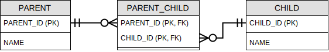

```java
@Entity
class Parent {
  @Id @GeneratedValue
  @Column(name = "PARENT_ID")
  private Long id;
  private String name;

  @ManyToMany
  @JoinTable(
    name = "PARENT_CHILD",
    joinColumns = @JoinColumn(name = "PARENT_ID"),
    inverseJoinColumns = @JoinColumn(name = "CHILD_ID")
  )
  private List<Child> children = new ArrayList<>();
  ...
}
```

```java
@Entity
class Child {
  @Id @GeneratedValue
  @Column(name = "CHILD_ID")
  private Long id;
  private String name;

  /**
   * 제가 그냥 한번 해봤어요. 양방향을 쓸일이 없대도, 이런식으로 하면 될까요?
  @ManyToMany(mappedBy = "children")
  private List<Parent> parents = new ArrayList<>();
   */
  ...
}
```

<br>

### 5. 엔티티 하나에 여러 테이블 매핑

`@SecondaryTable` 을 사용하면 하나의 엔티티에 여러 테이블을 매핑할 수 있대요.

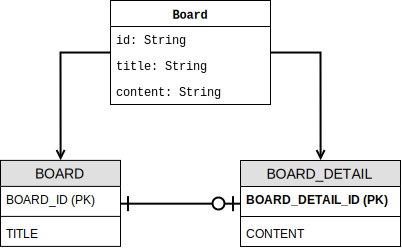

```java
@Entity
@Table(name = "BOARD")
@SecondaryTable(
  name = "BOARD_DETAIL",
  pkJoinColumns = @PrimaryKeyJoinColumn(name = "BOARD_DETAIL_ID")
)
class Board {
  @Id @GeneratedValue
  @Column(name = "BOARD_ID")
  private Long id;
  private String title;

  @Column(table = "BOARD_DETAIL")
  private String content;
  ...
}
```

새로운 annotation 이 등장했지만 속성 명칭들이 직관적이라서 따로 설명하지 않아도 이해 될 것 같네요.  
더 많은 테이블을 매핑하려면 `@SecondaryTables` 도 있대요.
