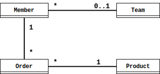

# 프록시와 연관관계 관리

## 1. 프록시

회원과 팀 엔티티가 존재 할 때, 회원을 조회하면 팀 까지 조회 되는게 비효율적이라고 생각해서 회원 엔티티의 `member.getTeam()` 과 같이 실제적으로 팀 엔티티가 필요한 시점에 실행(지연로딩)할 수 있는 가짜 객체를 "프록시 객체"라 한대요.

### 1.1 프록시 기초

프록시 객체를 직접 꺼내서 쓰고 싶다면 (실제 사용 시점까지 지연해서 로딩하고 싶다면) 저렇게 하면 된대요.

```java
Member member = em.getReference(Member.class, 1L);
```

저렇게 되면 `member.getName()` 같이 **실제 데이터를 사용할 때, DB를 조회해서 객체를 생성** 하고, 이를 **_프록시 객체의 초기화_** 라고 부르군요.

### 1.2 프록시와 식별자

좀 헷갈리게 써주셨지만, `em.getReference(...)` 활용해서 식별자 값만 활용해서 DB 접근 횟수를 줄일 수 있겠네요.

```java
Member member = em.find(Member.class, 1L);
Team team = em.getReference(Team.class, "TeamID");

member.setTeam(team);
```

### 1.3 프록시 확인

`PersistenceUnitUtil.isLoaded(Object entity)` 를 이용하면 프록시 객체의 인스턴스가 초기화 되었는지 여부를 확인 할 수 있대요.  
**이미 초기화 되었거나 프록시 객체의 인스턴스가 아니면** `true` !

<br>

## 2. 즉시 로딩과 지연 로딩

### 2.1 즉시 로딩

```java
#Entity
class Member {
  @ManyToOne(fetch = FetchType.EAGER)
  @JoinColumn(name = "TEAM_ID")
  private Team team;
}
```

이런 엔티티를 조회 하면,

```java
Member member = em.find(Member.class, 1L);
Team team = member.getTeam();
```

이러면 실행되는 쿼리가

```SQL
    SELECT M.MEMBER_ID,
           M.TEAM_ID,
           M.USERNAME,
           T.TEAM_ID,
           T.NAME
      FROM MEMBER M
LEFT OUTER
      JOIN TEAM T
        ON M.TEAM_ID = T.TEAM_ID
     WHERE M.MEMBER_ID = 1
```

주목할 점이 **OUTER JOIN** 을 사용했다는 건데, INNER JOIN 을 하게 하려면

- `@JoinColumn(id = ..., nullable = false)`
- `@ManyToOne(fetch = FetchType.EAGER, optional = false)`

이런 것들을 사용하면 된대요. 저것들이 선택적/필수적 관계를 명시하는건데, **선택적 관계면 OUTER JOIN** 을, **필수적 관계면 INNER JOIN** 을 사용한대요.

### 2.2 지연 로딩

```java
@Entity
class Member {
  @ManyToOne(fetch = FetchType.LAZY)
  @JoinColumn(name = "TEAM_ID")
  private Team team;
  ...
}
```

이렇게 엔티티 매핑을 하고,

```java
Member member = em.find(Member.class, 1L);
Team team = member.getTeam();

String teamName = team.getName(); // 실제로 team 객체 사용
```

저기에서 `team` 인스턴스는 프록시 객체이고 실제로 사용하기 전까지는 데이터 로딩을 미뤄둔대요.  
`em.find(Member.class 1L)` 이 실행 될때

```SQL
    SELECT *
      FROM MEMBER
     WHERE MEMBER_ID = 1
```

이런 SQL 이 실행되고, `team.getTeam()` 이 실행되면 그때 다음 SQL 이 실행된대요.

```SQL
    SELECT *
      FROM TEAM
     WHERE TEAM_ID = 'TeamID'
```

### 2.3 즉시로딩, 지연로딩 정리

책에 좋은 말씀 써주셨네요. 근데, 하이버네이트는 가능하면 즉시로딩(EAGER)을 하려고 한대요. 왜 그럴까요?🤔

<br>

### 3. 지연 로딩 활용



관계는 대충 보면 아시겠죠?  
사용 빈도가 있어서 조건은 이렇게 줬는데,

- Member의 Team은 자주 사용되어, 즉시로딩
- Member의 Order는 가끔 사용되어, 지연로딩
- Order의 Product는 함께 사용되니까, 즉시로딩

엔티티를 만들어 보아요~

```java
@Entity
class Member {
  @Id @GeneratedValue
  @Column(name = "MEMBER_ID")
  private Long id;
  private String userName;

  @ManyToOne(fetch = FetchType.EAGER)
  @JoinColumn(name = "TEAM_ID")
  private Team team;

  @OneToMany(mappedBy = "member", fetch = FetchType.LAZY)
  private List<Order> orders = new ArrayList<>();
  ...
}
```

`Member` 엔티티를 조회하면 SQL은,

```SQL
    SELECT M.MEMBER_ID,
           M.TEAM_ID,
           M.USER_NAME,
           T.ID,
           T.NAME
      FROM MEMBER M
      LEFT
OUTER JOIN TEAM T
     WHERE M.MEMBER_ID = 1
```

### 3.1 프록시와 컬렉션 래퍼

위의 엔티티에서 `member.getOrders()` 를 실행하면 `org.hibernate.collection.internal.PersistentBag` 타입의 객체가 튀어 나온대요.
이는 컬렉션의 변경 감지, 추적 등의 목적으로 **컬렉션 래퍼** 를 쓰기 때문이래요.

### 3.2 JPA 기본 페치 전략

- **@ManyToOne**, **@OneToOne** 즉시 로딩 (FetchType.EAGER)
- **@OneToMany**, **@ManyToMany** 지연 로딩 (FetchType.LAZY)

연관된 엔티티가 **단일 객체면 즉시 로딩**, **컬렉션이면 지연 로딩** 인게 JPA의 기본 페치<sub>fetch</sub> 전략 이래요.  
하지만 책에서 추천하는 건 **_모든 것에 지연로딩을 사용_** 하래요.

### 3.3 컬렉션에 FetchType.EAGER 사용 시 주의점

**컬렉션을 하나 이상 즉시 로딩하는 것은 권장 안함!**  
당연한 것 같으니까 대충 넘어갈게요. 성능 문제가 생기고, 너무 많은 결과는 메모리에서 필터링 해서 반환해 준다는데...

**컬렉션 즉시 로딩은 항상 외부 조인<sub>outer join</sub>을 사용**  
좀 복잡한 얘긴데, 내부 조인을 하면 관계가 맞춰져 있는 데이터만 조회가 되잖아요. 그래서 팀을 조회할 때, 회원이 없는 팀은 조회 안되는 경우가 생긴데요. got it?!👌

<br>

### 4. 영속성 전이: CASCADE

크.. 드디어 우리가 찾던 기능이 왔습니다. 영속성 전이<sub>transitive persistence</sub> 기능 말예요.


```java
@Entity
class Parent {
  @Id @GeneratedValue
  private Long id;

  @OneToMany(mappedBy = "parent")
  private List<Child> children = new ArrayList<>();
  ...
}
```

```java
@Entity
class Child {
  @Id @GeneratedValue
  private Long id;

  @ManyToOne
  private Parent parent;
}
```

이런 엔티티가 있었드랬죠. 이걸 `Parent` 가 1명 있고, `Child` 가 2개 있는 걸 만들면,

```java
Parent parent = new Parent();
em.persist(parent);

Child child1 = new Child();
child1.setParent(parent);
em.persist(child1);

Child child2 = new Child();
child2.setParent(parent);
em.persist(child2);
```

**JPA에서 엔티티를 저장할 때 연관된 모든 엔티티는 영속 상태여야 한다** 잖아요. 그래서 부모 만들고 자식 ~~새끼~~ 들 만들어서 넣잖아요, 왜. (근데, 이거 그냥 해도 되던데... hibernate 버전 때문인가... 책은 4.3 기준이에요.)

### 4.1 영속성 전이: 저장

`Parent` 엔티티에서,

```java
...
@OneToMany(mappedBy = "parent", cascade = CascadeType.PERSIST)
private List<Child> children = new ArrayList<>();
...
```

이렇게 `CascadeType.PERSIST` 속성을 주는 거죠. 그러면 저장할 때 저렇게도 된대요.

```java
Child child1 = new Child();
Child child2 = new Child();

Parent parent = new Parent();

child1.setParent(parent);
child2.setParent(parent);

parent.getChildren().add(child1);
parent.getChildren().add(child2);

em.persist(parent);
```

👏👏👏 브라보~!

### 4.2 영속성 전이: 삭제

지금까지 삭제 기능은 정말 가관이었죠.

```java
Parent parent = em.find(Parent.class, 1L);
Child child1 = em.find(Child.class, 1L);
Child child2 = em.find(Child.class, 2L);

em.remove(child1);
em.remove(Child2);
em.remove(parent);
```

이게 뭐람...  
하지만 `CascadeType.REMOVE` 가 설정되면,

```java
Parent parent = em.find(Parent.class, 1L);
em.remove(parent);
```

👏👏👏 굿잡~!

### 4.3 CASCADE 종류

- `ALL`
- `PERSIST`
- `MERGE`
- `REMOVE`
- `REFRESH`
- `DETACH`

이런 애들이 있대요.  
쓰임새는 아시겠죠?!

<br>

## 5. 고아 객체

**부모 엔티티와 연결이 끊이진 자식 엔티티를 자동 삭제해주는 "고아 객체 제거(orphan)** 기능이 있대요.

**부모 엔티티의 컬렉션에서 자식 엔티티의 참조만 제거하면 자식 엔티티가 자동으로 삭제** 되는 매직을 시현해 보인답니다.

```java
@Entity
class Parent {
  @Id @GeneratedValue
  private Long id;

  @OneToMany(mappedBy = "parent", orphanRemoval = true)
  private List<Child> children = new ArrayList<>();
  ...
}
```

이렇게 `orphanRemoval = true` 속성만 있으면,

```java
Parent parent = em.find(Parent.class, 1L);
parent.getChildren().remove(0);
```

이렇게 컬렉션에서만 지웠는데,

```SQL
    DELETE
      FROM CHILD
     WHERE ID = ?
```

이런 SQL 이 실행 된대요.

<br>

## 6. 영속성 전이 + 고아 객체, 생명주기

`CascadeType.ALL` 하고 `orphanRemoval = true` 를 같이 써버리면 어떻게 될꺼냐고 묻는다... 😷 유구무언...

부모 엔티티가 알아서 자식 엔티티의 생명주기를 관리 한대요.  
완전 객체 다루듯 DB도 다루는게 되는 거겠네요.
