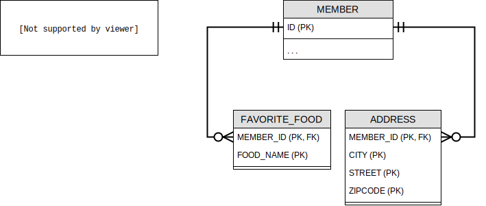

# 값 타입

## 1. 기본값 타입

엔티티는 엔티티 타입, 다른 값은 기본값 타입이라는데...  
너무 뻔하군요.

```java
@Entity
class Member {
  @Id @GeneratedValue
  private Long id;

  private String name; // <= 이런 애들은 기본값 타입
  private Integer age; // <= 이런 애들은 기본값 타입
}
```

<br>

## 2. 임베디드 타입(복합 값 타입)

**임베디드 타입<sub>embedded type</sub>** 이란 새로운 값 타입을 정해서 쓸 수 있는 거래요.

예를들면, 회원 정보에 "근무 시작일", "근무 종료일" 이 있다고 해봐요. 그 항목들을 개별적으로 관리하는 것보다 "근무 기간" 이라 정해서 그안에서 시작일과 종료일을 가지게 하면 더 명확하네요.

```java
@Entity
class Member {
  @Id
  private Long id;

  @Embedded
  private Period workPeriod;

  ...

  @Embeddable
  static class Period {
    @Temporal(TemporalType.DATE)
    private LocalDate start;

    @Temporal(TemporalType.DATE)
    private LocalDate end;

    @Column(name = "TIME_PER_DAY")
    private Integer workingTime;

    ...

    // 메서드도 정의해서 쓸 수 있대요. (넘 당연한건가...)
    public void isHire(LocalDate date) {
      return date.getDayOfWeek() != SATURDAY &&
             date.getDayOfWeek() != SUNDAY;
    }
  }
}
```

음, 쓸만 하군요.

### 2.1 임베디드 타입과 테이블 매핑

  
이렇게 된대요.

### 2.2 임베디드 타입과 연관관계

다른 엔티티를 참조할 수도 있대요. 연관관계 맺는게 가능하다고요.

### 2.3 @AttributeOverride(s): 속성 재정의

임베디드 타입이 두개가 되면 사용 할 수 있겠네요. 예를들면, `Period` 가 "workPeriod"와 "albaPeriod" 이렇게 두개가 되면 말예요.

```java
@Entity
class Member {
  @Id @GeneratedValue
  private Long id;

  @Embedded
  private Period workPeriod;

  @Embedded
  @AttributeOverrides({
    @AttributeOverride(name = "start", column = @Column(name = "ALBA_START")),
    @AttributeOverride(name = "end", column = @Column(name = "ALBA_END")),
  })
  private Period albaPeriod;
  ...
}
```

### 2.4 임베디드 타입과 null

```java
member.setWorkPeriod(null);
em.persist(member);
```

저러면 한꺼번에 `Period` 안의 모든 필드들이 `null` 이됩니다요.

<br>

## 3. 값 타입과 불변 객체

대충 설명하고 넘어 가려다가 왠지 저건 좋은 말인 것 같아서 남겨봐요.

> 값 타입은 복잡한 객체 세상을 조금이라도 단순화하려고 만든 개념이다.  
> 따라서 값 타입은 단순하고 안전하게 다룰 수 있어야 한다.

뭔가 명언 같애~😍

### 3.1 값 타입 공유 참조

값 타입으로 만든 객체의 인스턴스를 공유하는 건 위험 하대요. 당연한 말씀.

### 3.2 값 타입 복사

객체의 `clone()` 으로 복사(복제)해서 쓰래요.  
흙수저가 금수저가 될 수 없잖아요. 타고 난대로, Java에서 **객체의 공유 참조는 피할 수 없다** 고 하네요.

### 3.3 불변 객체

그래서 흙수저는 노력했어요. 열심히 노력한 끝에 방법을 찾았답니다. 태생의 운명을 겸허히 받아 들이고 자기 자신의 내면을 단련해서 **불변하게 만들어 버리자** 라고요.
변하지 말자고 다짐하고서 setter 라는 허울은 벗어 던져 버린거죠.

```java
@Embeddable
@Getter
// @Setter  -- 외부의 자극은 나를 변질되게 한다해서 setter는 주석
class Address {
  private Stirng city;

  protected Address() {} // 기본 생성자는 필수 니까 😉
  public Address(String city) {
    this.city = city;
  }
}
```

이로써 값 타입 객체는 불편객체가 되어서 부작용을 방지하고 행복하게 살았답니다.

<br>

## 4. 값 타입의 비교

`equals(...)` 와 `hashCode()` 를 override 해서 구현하라는 얘기네요. lombok의 `@EqualsAndHashCode` 가 알아서 해주는 거니깐 해주자구요~

<br>

## 5. 값 타입 컬렉션

```java
@Entity
class Member {
  @Id @GeneratedValue
  private Long id;

  @Embedded
  private Address address;

  @ElementCollection
  @CollectionTable(
    name = "FAVORITE_FOODS",
    joinColumns = @JoinColumn(name = "MEMBER_ID")
  )
  @Column(name = "FOOD_NAME")
  private Set<String> favoriteFoods = new HashSet<>();

  @ElementCollection
  @CollectionTable(
    name = "ADDRESS",
    joinColumns = @JoinColumn(name = "MEMBER_ID")
  )
  private List<Address> addressHistory = new ArrayList<>();
  ...
}
```

이걸 다이어그램으로 그리면,



### 5.1 값 타입 컬렉션 사용

`em.persit(...)` 한방으로 여러번 INSERT SQL이 실행되겠죠, 당연히.  
그리고 조회할 때는 기본으로 `FetchType.LAZY` 라고 하네요.
그리고 `CascadeType.ALL` + `orphanRemoval=true` 라서 하나의 엔티티에 유기체적으로 관리되겠네요.

### 5.2 값 타입 컬렉션의 제약사항

하나의 엔티티에 연결된 값 타입 컬렉션에 변경이 발생되면, 값 타입 컬렉션이 매핑된 테이블에서 엔티티에 연결된 데이터를 모두 지운 후, 다시 저장한대요.  
말로 의미 해석이 힘드니까 SQL을 보자면,

```SQL
-- ID가 "100"인 회원의 주소가 변경된다면
DELETE
  FROM ADDRESS
  WHERE MEMBER_ID = 100;

INSERT
  INTO ADDRESS (MEMBER_ID, CITY, STREET, ZIPCODE)
VALUES (100, ...);

INSERT
  INTO ADDRESS (MEMBER_ID, CITY, STREET, ZIPCODE)
VALUES (100, ...)
```

이런식으로 처리가 되기 때문에 **값 타입 컬렉션이 매핑된 테이블에 데이터가 많아지면 일대다 관계로 전환을 고려** 해보래요.
