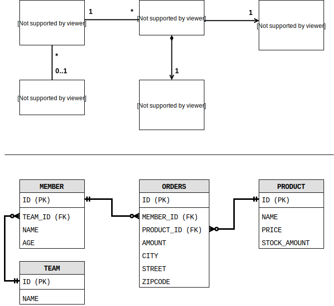

# 객체지향 쿼리 언어

## 1. 객체지향 쿼리 소개

### 1.1 JPQL 소개

- DB 벤더에 의존하지 않고
- SQL 보다 간결하대요.

```java
String jpql = "select m from Member as m where m.username = 'kim'";
List<Member> resultList = em.createQuery(jpql, Member.class).getResultList();
```

### 1.2 Criteria 쿼리 소개

`String` 으로 작성하는게 아니라 `query.select(m).where(...)` 이렇게 코드로 작성

- 동적쿼리 작성이 쉽고
- IDE 를 통해 Auto Intellisence 를 쓰고
- 컴파일(또는 작성) 시점에 오류 확인 할 수 있어요.

```java
CriteriaBuilder cb = em.getCriteriaBuilder();
CriteriaQuery<Member> query = cb.createQuery(Member.class);

Root<Member> m = query.from(Member.class);

CriteriaQuery<Member> cq = query.select(m).wehre(cb.equal(m.get("username"), "kim"));
List<Member> resultList = em.createQuery(cq).getResultList();
```

아직은 뭔지 모르겠지만, 이렇게 하는 거래요. 뭔가 복잡하군요.  
책에서도 **"모든 장점을 상쇄할 정도록 복잡하다"** 라고 말하네요. 크나큰 단점.

### 1.3 QueryDSL 소개

> JPA 표준은 아니고 오픈소스 프로젝트래요. MongoDB, Java Collection, Lucene, Hibernate Search 도 거의 같은 문법으로 지원하고요.

```java
JPAQuery queyr = new JPAQuery(em);
QMember member = QMember.member;

List<Member members = query.from(member)
                        .where(member.username.eq("kim"))
                        .list(member);
```

### 1.4 네이티브 SQL 소개

특정 DB vendor에 종속적인 기능 수행 등, 아무튼 그냥 SQL을 그대로 실행하는 거에요.

```java
STring sql = "SELECT ID, AGE FROM MEMBER = NAME = 'kim'";
List<Member> resultList = em.createNativeQuery(sql, Member.class).getResultList();
```

### 1.5 JDBC 직접 사용, 마이바티스 같은 SQL 매퍼 프래임워크 사용

JPA랑 따로 놀게 사용되면 데이터 무결성이 손상될 수 있겠단 얘길 하네요. 당연히도 그러겠죠. 그래서 JPA 영속성 컨텍스트를 동기화(적절한 시점에 `em.flush()` 를 날려서)해서 쓰라고 하네요.

<br>

## 2. JPQL

특징을 말하자면,

- 엔티티 객체를 대상으로 쿼리를 하고,
- 추상화 되어 있어서, 특정 DBMS에 의존적이지 않고,
- 결국은 SQL로 변환된대요.

  
이걸로 엔티티를 만들어 보려나 봐요.

### 2.1 기본 문법과 쿼리 API

JPQL 에는 `SELECT`, `UPDATE`, `DELETE` 구분이 있고 저장은 `EntityManager.persist(...)` 을 사용하니까 `INSERT` 는 없대요.

**대소문자 구분**하는데, 클래스나 필드명만 그렇고 `SELECT`, `FROM`, `AS` 같은 건 구분 안한대요.  
**엔티티 이름**으로 `FROM` 절에 사용한대요.  
**별칭은 필수**로 있어야 한대요.

반환할 타입을 명확하게 알면 `TypeQuery`, 아님 그냥 `Query` 쓴대요.

```java
String jpql = "SELECT m FROM Member m";

TypedQuery<Member> q = em.createQuery(jpql, Member.class);
List<Member> members = q.getResultList();

Query q = em.createQuery(jpql);
List members = query.getResultList();
```

조회 후 결과 반환 API는 `q.getResultList()` 랑 `q.getSingleResult()` 가 있대요.
(싱글은 없거나, 결과 갯수가 1이 아니면 `javax.persistence.NoResultException` 하고 `javax.persistence.NonUniqueResultException`)

### 2.2 파라미터 바인딩

"이름"과 "위치" 기준 파라미터가 있대요.

```java
List<Member> members = em
  .createQuery("SELECT m FROM Member m WHERE m.username = :username", Member.class)
  .setParameter("username", "greenb")
  .getResultList();
```

```java
List<Member> members = em
  .createQuery("SELECT m FROM Member m WHERE m.username = ?1", Member.class)
  .setParameter(1, "greenb")
  .getResultList();
```

### 2.3 프로젝션

`SELECT` 절에 조회할 대상을 지정하는 걸 **프로젝션<sub>projection</sub>** 이라고 한대요.

#### 엔티티 프로젝션

```SQL
SELECT m FROM Member m // 회원
```

```SQL
SELECT m.team FROM Member m // 팀
```

#### 임베디드 타입 프로젝션

임베디드 타입은 조회의 시작점이 될 수 없다는 제약이 있다네요. 번거롭게...  
그래서 `Order` 에서 `o.address` 이렇게 불러 와야만 한대요.

```java
String q = "SELECT o.address FROM Order o";
List<Address> addresses = em
    .createQuery(q, Address.class)
    .getResultList();
```

#### 스칼라 타입 프로젝션

숫자, 문자, 날짜 같은 기본 데이터 타입을 **스칼라 타입** 이라고 한대요. (금시초문인데.. 학교를 스칼라 라고 했던거 아닌가?)

```java
List<String username = em
    .createQuery("SELECT username FROM Member m", String.class)
    .getResultList();
```

여기서 데이터 중복을 제거하려면,

```java
SELECT DISTINCT username FROM Member m
```

`DISTINCT` 구문을 쓸 수 있대요.

#### 여러 값 조회

```java
Query query = em.createQuery("SELECT m.username, m.age FROM Member m");
List resultList = query.getResultList();

Iterator it = resultList.iterator();
whiel (it.hasNext()) {
  Object[] row = (Object[]) it.next();
  String username = (String) row[0];
  Integer age = (Integer) row[1];
}
```

힘드네요, `TypedQuery` 를 쓸 수 없으니까요.

#### new 명령어

불편한건 역시 극복하려는 본능을 자극하죠.

```java
package pkg;

@AllArgsConstructor
static class UserDTO {
  private String username;
  private Integer age;
}
```

이런 DTO를 이용해서,

```java
TypedQuery<UserDTO> q = em.createQuery("SELECT new pkg.UserDTO(m.username, m.age) FROM Member m", UserDTO.class);
List<UserDTO> resultList = q.getResultList();
```

짜잔~ 👏👏👏

### 2.4 페이징 API

```java
List<Member> members = em
    .createQuery("SELECT m FROM Member m", Member.class)
    .setFirstResult(10) // 시작위치. 0부터 시작
    .setMaxResults(20) // 조회 데이터 수
    .getResultList();
```

### 2.5 집합과 정렬

```SQL
SELECT count(m),  // 갯수
       sum(m.age), // 나이의 합
       avg(m.age), // 나이의 평균
       max(m.age), // 최대 나이
       min(m.age)  // 최소 나이
  FROM Member m
```

집합 함수들은,

- `null` 값은 무시돼서 통계에 잡히지 않고 (DISTINCT 에서도 무시)
- 값이 없는데, `sum`,`age`,`max`,`min` 을 쓰면 결과도 `null`
- `count(DISTINCT m.age)` 이렇게 함수 안에도 쓸 수 있대요. (임베디드 타입은 지원 안하고)

`GROUP BY`, `HAVING`, `ORDER BY` 는 사용방식이 똑같네요, RDB랑.

### 2.6 JPQL 조인

```java
List<Member> members = em
    .createQuery("SELECT m FROM Member m INNER JOIN m.team t WHERE t.name = :teamName")
    .setParameter("teamName", "A")
    .getResultList();
```

조인도 비슷하죠.

```SQL
SELECT m FROM Member LEFT [OUTER] JOIN m.team t
```

외부 조인은 저렇게 한대요. `OUTER` 는 SQL에서도 그렇지만 여기서도 생략가능하대요.  
컬렉션 값으로 조인하는 "컬렉션 조인", 관계가 없이 조인을 하는 "세타 조인"도 있네요.  
JPA 2.1 부터는 `JOIN ON` 절이 있어서 SQL과 좀 더 비슷하게 쓸 수도 있네요.

### 2.7 페치 조인

JPQL 에서만 쓰는 성능 최적화를 위한 기능이래요.
여러가지 좋은 기능이 있군요. 하지만 최적화의 관점에서 벗어나면 사용이 꺼려지겠어요.

### 2.8 경로 표현식

`.` 을 찍서어 객체 그래프를 탐색하는 거래요.

```sql
SELECT m.username
  FROM Member m
  JOIN m.team t
  JOIN m.orders o
 WHERE t.name = 'A'
```

`m.username` 은 상태 필드,  
 `m.team` 은 단일 값 연관 필드로 `@ManyToOne`, `@OneToOne` 로 관계된 엔티티  
 `m.orders` 는 컬렉션 값 연관 필드로 `@OneToMany` `@ManyToMany` 로 관계된 컬렉션 엔티티군요.

```java
@Entity
class Member {
  @Id @GeneratedValue
  private Long id;

  private String username; // 상태 필드
  private Integer age; // 상태 필드

  @ManyToOne(...)
  private Team team; // 단일 값 연관 필드

  @OneToMany(...)
  private List<Order> order; // 컬렉션 값 연관 필드
}
```

상태 필드는 객체 그래프 탐색을 더 할 수 없고, 단일 값 연관 경로는 묵시적으로 내부 조인이 일어나면서 계속 탐색이 가능 하대요. 컬렉션 값 연관 경로는 똑같이 묵시적 내부 조인이 일어나는데, 더는 탐색할 수 없대요. 단, `FROM` 절에서 조인을 통해 별칭을 얻으면 별칭으로 탐색 할 수 있고요.

상태 필드 경로 탐색은 쉬운데, 복잡한
**단일값 연관 경로 탐색**을 정리해 봅시다.

```SQL
SELECT o.member.team
  FROM Order o
 WHERE oproduct.name = 'product-a'
   AND o.address.city = 'incheon'
```

이런 JPQL이 실행되면 실제 SQL은,

```SQL
    SELECT t.*
      FROM ORDERS O
INNER JOIN MEMBER M ON O.MEMBER_ID = M.ID
INNER JOIN TEAM T ON M.TEAM_ID = T.ID
INNER JOIN PRODUCT P ON O.PRODUCT_ID = P.ID
     WHERE P.NAME = 'product-a'
       AND O.CITY = 'incheon'
```

이렇게 실행 된데요.

** 컬렉션 값 연관 경로 탐색**은

```SQL
SELECT m.username
  FROM Team t
  JOIN t.members m
```

`join t.members m` 으로 컬렉션에 별칭을 얻고, 거기서 경로 탐색을 할 수 있는 거에요.

경로 탐색을 사용한 묵시적 조인 시 주의사항은

- **항상 내부 조인** 이고,
- 컬렉션은 경로 탐색의 끝!
- 주로 `SELECT`, `WHERE` 에서 사용하지만 묵시적으로 조인되니까 `FROM` 에 영향을 준대요.

결론적으로, 조인이 성능차에 큰 영향이 있으니 묵시적인 조인 보다 분석에 좋은 명시적 조인을 사용하라고 하네요.

### 2.9 서브 쿼리

`WHERE`, `HAVING` 절에서만 사용 할 수 있대요. 구현체에 따라 좀 다를 수 있고요.

```SQL
SELECT m
  FROM Member m
 WHERE m.age > (  SELECT avg(m2.age)
                    FROM Member m2 )
```

이런 식으로 쓰면 되군요.  
`EXISTS` 절은,

```SQL
SELECT m
  FROM Member m
 WHERE EXISTS (  SELECT t
                   FROM m.team t
                  WHERE t.name = 'A'  )
```

이러고요.  
`IN` 절은,

```SQL
SELECT m
  FROM Team t
 WHERE t IN (  SELECT t2
                 FROM Team t2
                 JOIN t2.members m2
                WHERE m2.age >= 20  )
```

### 2.10 조건식

| 종류        | 설명                                              | 예시                      |
| ----------- | ------------------------------------------------- | ------------------------- |
| 문자        | 작은 따옴표 ('를 사용하고 싶으면 '를 두번 `''` )  |                           |
| 숫자        | Long 타입은 1L, Double 타입은 1D, Float 타입은 1F |                           |
| 날짜        | DATE {d 'yyyy-MM-dd'}                             | {d'1234-01-31'}           |
|             | TIME {t 'hh:mm:ss'}                               | {t'12:34:56'}             |
|             | DATETIME {ts 'yyyy-MM-dd hh:mm:ss.f'}             | {ts'1234-01-31 12:34:56'} |
| Boolean     | TRUE 나 FALSE                                     |                           |
| Enum        | Signature(패키지 포함한 전체 이름)                | jpabook.MemberType.Admin  |
| 엔티티 타입 | 엔티티의 타입을 표현, 주로 상속과 관련해서 사용   | TYPE(m) = Member          |

JPQL에서 사용하는 타입은 대소문자 구분이 없대요.

**_연산자 우선순위_** 는,

1. 경로 탐색 연산 `.` (점)
2. 수학 연산 - `+(양수)`, `-(음수)`, `*`, `/`, `+`, `-`
3. 비교 연산 `=`, `>`, `>=`, `<`, `<=`, `<>`, `[NOT] BETWEEN`, `[NOT] LIKE`, `[NOT] IN`, `IS [NOT] NULL`, `IS [NOT] EMPTY`, `[NOT] MEMBER [OF]`, `[NOT] EXISTS`
4. 논리 연산 `NOT`, `AND`, `OR`

**_논리 연산_** 에서,

- `AND` 는 둘다 만족하면 참
- `OR` 는 둘 중 하나만 만족해도 참
- `NOT` 은 조건식의 결과의 반대

**_비교식_** 은,  
`=`, `>`, `>=`, `<`, `<=`, `<>` 이런게 있네요.

**_BETWEEN, IN, LIKE, IS NULL_** 같은 SQL과 같은 것들이 있고,  
**_컬렉션 식_** 이라고 컬렉션에서만 사용하는게 있대요.

```SQL
SELECT m
  FROM Member m
 WHERE m.orders IS NOT EMPTY
```

이렇게 JPQL 을 쓰면 SQL은 다음처럼 나온다고 하네요.

```SQL
SELECT *
  FROM MEMBER M
 WHERE EXISTS (  SELECT O.ID
                   FROM ORDERS O
                  WHERE O.MEMBER_ID = M.ID  )
```

**_스칼라 식_** 이라고 숫자, 문자, 날짜, case, 엔티티 타입 같은 가장 기본적인 타입을 사용하는 식이 있는데,  
 `+`, `-` 같은 단항 연산자, 사칙연산등이 있죠.

**_문자함수_** 도 있는데,

- `CONCAT('A', 'B', ...)` --> "AB..."
- `SUBSTRING('ABCD', 2, 3)` --> "BCD"
- `TRIM(' ABC ')` --> "ABC"
- `LOWER('ABC')` --> "abc"
- `UPPER('abc')` --> "ABC"
- `LENGTH('ABC')` --> 3
- `LOCATE('C', 'ABC' [, 1])` --> 2

**_수학함수_** 는,

- `ABS(-123)` --> 절대값 123
- `SQRT(4)` --> 제곱근 2.0
- `MOD(4, 3)` --> 나머지 1
- `SIZE(t.members)` --> 컬렉션의 갯수 n
- `INDEX(별칭)` --> List 타입 컬렉션의 위치값을 구한대요.

**_날짜함수_** 는,

- `CURRENT_DATE` 현재 날짜
- `CURRENT_TIME` 현재 시간
- `CURRENT_TIMESTAMP` 현재 날짜 시간

**_CASE 식_** 은 SQL과 동일하고, 심플CASE 도 있는데 java switch...case 랑 비슷하네요.

**_COALESCE_** 는

```SQL
 SELECT COALESCE(m.username, '무명')
   FROM Member m
```

`username` 이 없으면, `무명` 이라고 나오는 거.

**_NULLIF_** 는

```SQL
 SELECT NULLIF(m.username, '관리자')
   FROM Member m
```

`username` 이 `관리자` 면, `NULL`을 반환하고 아니면 그냥 `username` 반환합니다.

### 2.11 다형성 쿼리

`@Inheritance` 써서 만든 다형성 엔티티가 있으면,

```java
@Entity
@Inheritence(strategy = InheritanceType.SINGLE_TABLE)
@DiscriminatorColumn(name = "DTYPE")
abstract class Item { ... }

@Entity
@DiscriminatorValue("B")
class Book extends Item { ... }
```

이런 형태를 JPQL로 조회 하면,

```java
List list = em.createQuery("SELECT i FROM Item i").getResultList();
```

이러면 알아서 자식도 함께 조회한대요.  
`@DiscriminatorColumn` 은 조건으로 넣을 수 없어서

```SQL
SELECT i
  FROM Item i
 WHERE TYPE(i) IN (Book, Movie)
```

이렇게 쓸 수 있고,

```SQL
SELECT i
  FROM Item i
 WHERE TREAT(i as Book).author = 'greenb'
```

이렇게 캐스팅 같이 쓰는 `TREAT` 라는 것도 있네요. (JPA 2.1부터)

### 2.12 사용자 정의 함수 호출

이것도 JPA 2.1 부터 지원한대요. 방언 클래스 `H2Dialect` 같은 걸 상속해서 구현하면 되고,

```SQL
SELECT 구현한_함수이름(i.name)
  FROM Item i
```

이렇게 쓰면 된대요.

### 2.13 기타 정리

DB에 따라서 empty string 을 `NULL` 로 여기는게 있어서 확인하고 쓰래요.

`NULL` 은 `IS NULL` 로만 true 가 될 수 있고, 비교 연산이나 수학적 계산 결과가 `NULL` 이 됩니다.

### 2.14 엔티티 직접 사용

`SELECT COUNT(m.id) FROM Member m` 이랑  
`SELECT COUNT(m) FROM Member m` 같은 거래요. 실행되는 SQL이 같다는 얘기.

이것도 같은 거래요.

```java
List list = em
    .createQuery("SELECT m FROM Member m WHERE m = :member")
    .setParameter("member", new Member(4L))
    .getResultList();
```

```java
List list = em
    .createQuery("SELECT m FROM Member m WHERE m.id = :id")
    .setParameter("id", 4L)
    .getResultList();
```

### 2.15 Named 쿼리: 정적 쿼리

그냥 기존에 바로 작성해서 사용하는 걸 **동적쿼리** 라고 하고, 이름표를 달아서 미리 정의 해놓고 쓰는 걸 **정적쿼리** 라고 한대요.

```java
@Entity
@NamedQuery(
  name = "Member.findByUsername",
  query = "SELECT m FROM Member m WHERE m.username = :username"
)
class Member { ... }
```

이렇게 엔티티에다가 정의를 하고,

```java
List<Member> members = em
    .createNamedQuery("Member.findByUsername", Member.class)
    .setParameter("username", "greenb")
    .getResultList();
```

이렇게 쓰면 된대요. 이름표를 붙일 때 엔티티명을 같이 써주면 좋은게 `@NamedQuery(s)` 가 전역적으로 사용되니까 구별하기 편해서 그렇대요.

XML로 정의 해서 쓸 수도 있대요.
xmlns는 http://xmlns.jcp.org/xml/ns/persistence/orm 이니깐 참고해서 쓰면 되겠네요.
