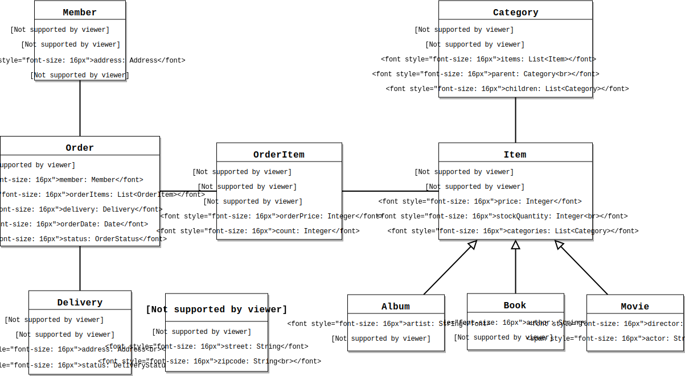
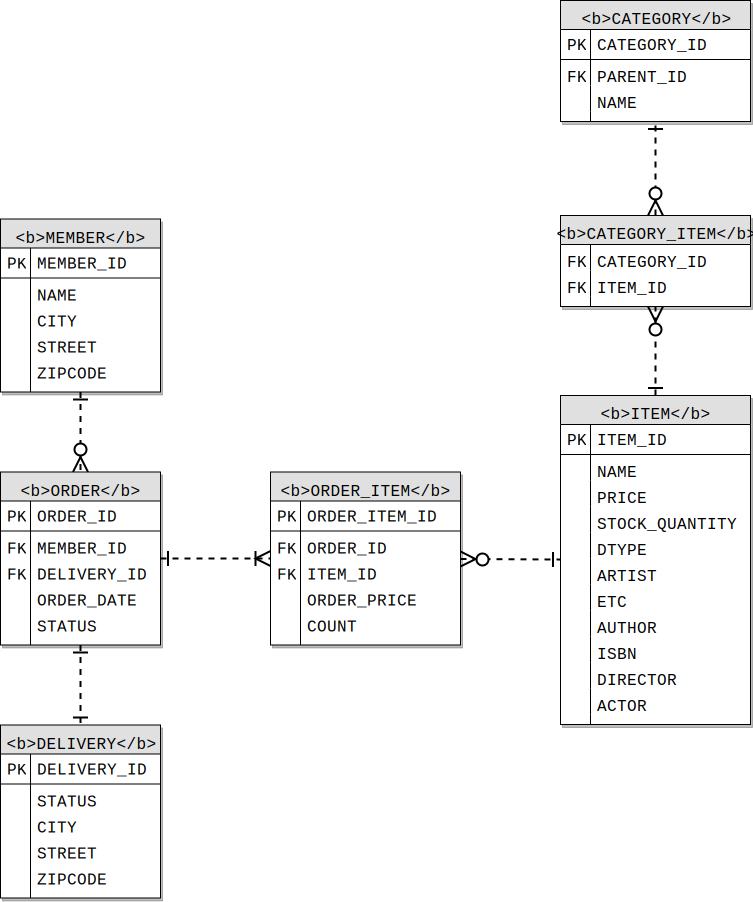

# 웹 애플리케이션 제작
## 도메인 모델과 테이블 설계
쇼핑몰 애플리케이션을 만듭니다. 요구사항은 다음과 같아요.
- 회원 
  - 등록
  - 조회
- 상품
  - 등록
  - 수정
  - 조회
- 주문
  - 상품 주문
  - 주문 내역 조회
  - 주문 취소
- 기타
  - 상품의 종류는 도서, 음반, 영화
  - 상품을 카테고리로 구분 할 수 있음
  - 상품 주문 시 배송 정보를 입력 할 수 있음

### 도메인 모델 설계

요구사항을 도메인 모델로 그리면,

이런 도메인 모델을 상세히 그리면,

### 테이블 설계
테이블을 설계합니다.

### 엔티티 클래스
이제 코드 들어갑니다.  
코드는 [깃헙](https://github.com/greenn-lab/jpa/tree/master/jpashop)으로...