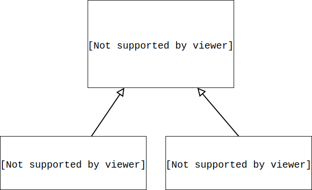
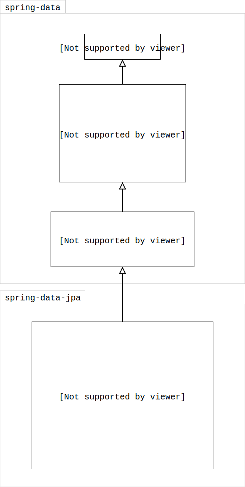

# spring-data-jpa

데이터 접근 계층<sub>Data Access Layer</sub>은 대부분이 CRUD 구성을 하고 있어서 반복된 개발을 해요. 그걸 효과적으로 개선하는게 "spring-data-jpa" 이가 봐요.

## 2.1 spring-data-jpa 소개

데이터 접근 계층을 개발할 때 **구현 클래스 없이 인터페이스만 작성** 할 수 있게 도와 준대요.

```java
interface MemberRepository extends JpaRepository<Member, Long> {
  Member findByUsername(String username);
}
```

이렇게 특정 기능을 명세한 인터페이스만 만들고 기본 CRUD 명세는 상속 받아 구성되고요.



인터페이스의 구현체는 spring-data-jpa가 동적으로 생성해서 주입해주니까 그대로 끝!

### 1.1 스프링 데이터 프로젝트

여러 데이터 저장소의 접근을 추상화한거래요. 저자께서 적극적으로 사용하래요.

<br>

## 2. spring-data-jpa 설정

새로운 시스템을 구축할 때 기술 스택에 spring-data-jpa가 포함된다면 아마도 `spring-boot` 을 사용할거라 사료됩니다.  
그래서 책의 내용이 과거의 형태임을 감안해 해당 단락은 정리하지 않았습니다.

<br>

## 3. 공통 인터페이스



인터페이스의 계층은 이렇게 구성되어 있네요.

<br>

## 4. 쿼리 메소드 기능

메소드 이름으로 쿼리를 생성하는 기능이래요. 기대됩니다.

- JAP NamedQuery 를 호출하고,
- `@Query` 을 사용해서 Repository 인터페이스에 직접 정의 된대요.

### 4.1 메소드 이름으로 쿼리 생성

```java
interface MemberRepository extends Repository<Member, Long> {
  List<Member> findByEmailAndName(String email, String name);
}
```

이렇게 정의하면,

```SQL
  SELECT m
    FROM Member m
   WHERE m.email = ?1
     AND m.name = ?2
```

이런 JPQL이 만들어 진대요.

아래의 표는 쿼리를 생성하는 키워드에 대한 최신 명세에요.
https://docs.spring.io/spring-data/jpa/docs/2.2.x/reference/html/#jpa.query-methods.query-creation
|Keyword|Sample|JPQL snippet|
|--- |--- |--- |
|And|findByLastnameAndFirstname|… where x.lastname = ?1 and x.firstname = ?2|
|Or|findByLastnameOrFirstname|… where x.lastname = ?1 or x.firstname = ?2|
|Is,Equals|findByFirstname,findByFirstnameIs,findByFirstnameEquals|… where x.firstname = ?1|
|Between|findByStartDateBetween|… where x.startDate between ?1 and ?2|
|LessThan|findByAgeLessThan|… where x.age < ?1|
|LessThanEqual|findByAgeLessThanEqual|… where x.age <= ?1|
|GreaterThan|findByAgeGreaterThan|… where x.age > ?1|
|GreaterThanEqual|findByAgeGreaterThanEqual|… where x.age >= ?1|
|After|findByStartDateAfter|… where x.startDate > ?1|
|Before|findByStartDateBefore|… where x.startDate < ?1|
|IsNull|findByAgeIsNull|… where x.age is null|
|IsNotNull,NotNull|findByAge(Is)NotNull|… where x.age not null|
|Like|findByFirstnameLike|… where x.firstname like ?1|
|NotLike|findByFirstnameNotLike|… where x.firstname not like ?1|
|StartingWith|findByFirstnameStartingWith|… where x.firstname like ?1 (parameter bound with appended %)|
|EndingWith|findByFirstnameEndingWith|… where x.firstname like ?1 (parameter bound with prepended %)|
|Containing|findByFirstnameContaining|… where x.firstname like ?1 (parameter bound wrapped in %)|
|OrderBy|findByAgeOrderByLastnameDesc|… where x.age = ?1 order by x.lastname desc|
|Not|findByLastnameNot|… where x.lastname <> ?1|
|In|findByAgeIn(Collection<Age> ages)|… where x.age in ?1|
|NotIn|findByAgeNotIn(Collection<Age> ages)|… where x.age not in ?1|
|True|findByActiveTrue()|… where x.active = true|
|False|findByActiveFalse()|… where x.active = false|
|IgnoreCase|findByFirstnameIgnoreCase|… where UPPER(x.firstame) = UPPER(?1)|

### 4.2 JPA NamedQuery

메소드 이름으로 `@NamedQuery` 를 호출 한대요.

```java
@Entity
@NamedQuery(
  name = "Member.findByUsername",
  query = "SELECT m FROM Member m WHERE m.username = :username"
)
public class Member { ... }
```

이렇게 엔티티 클래스에 정의 됐거나,

```XML
<named-query name="Member.findByUsername">
  <query><![CDATA[
  SELECT m
    FROM Member m
   WHERE m.username = :username
  ]]><query>
</named-query>
```

XML에 정의 된 것을,

```java
public interface MemberRepository extends JpaRepository<Member, Long> {
  List<Member> findByUsername(@Param("username") String userame);
}
```

이렇게 호출 할 수 있대요.
네이티브 쿼리도 마찬가지고.

`엔티티(도메인) 클래스` + `.` + `메소드 이름`  
이렇게 된 NamedQuery 를 찾는답니다.

### 4.3 @Query, 리포지토리 메소드에 쿼리 정의

```java
public interface MemberRepository extends JpaRepository<Member, Long> {
  @Qeury("SELECT m FROM Member m WHERE m.username = ?1")
  Member findByUsername(String username);
}
```

이렇게 쓸 수 있는 거래요. `@Query` 속성중에 `nativeQuery = true` 로 네이티브 쿼리 작성할 수도 있대요.  
근데 **네이티브 쿼리는 <font color="red">위치 기반 파라미터가 0 부터</font> 시작**한대요.

### 4.4 파라미터 바인딩

spring-data-jpa는 위치/이름 기반 파라미터를 다 지원한대요. 당연히 `@Param` 를 써서 이름 기반 파라미터를 쓰라고 하네요.

> Spring 4.x+, Java 8 이후부터는 `-parameters` 컴파일러 플래그를 달면 파라미터 이름을 찾을 수 있대요. 그래서 `@Param` 을 안써도 된대요.  
> https://docs.spring.io/spring-data/jpa/docs/2.2.x/reference/html/#jpa.named-parameters

### 4.5 벌크성 수정 쿼리

```java
@Modifying
@Query("UPDATE Product p SET p.price * 1.1 WHERE p.stockAmount < :stockAmount")
int bulkPriceUp(@Param("stockAmount") String stockAmount);
```

벌크로 수정, 삭제 쿼리를 쓰면 `@Modifying` 을 달면 된대요.  
`@Modifying(clearAutomatically = true)` 를 하면 벌크 쿼리를 실행 후, 영속성 컨텍스트를 초기화 해준대요.

### 4.6 반환 타입

spring-data-jpa는 유연하게 반환 타입을 지원해줘서,

```java
List<Member> findByName(String name);
Member findByEmail(String email);
```

각 경우를 알아서 처리해 준대요.  
근데 만약, 단일건이라 명시했는데 데이터가 2건 이상 조회된다면 `javax.persistence.NonUniqueResultException` 이 난대요.
그리고 단일건인데 조회된 데이터가 없으면, JPA는 `javax.persistence.NoResultException` 이 나지만, **spring-data-jpa는 예외를 무시하고 null을 반환**한대요.(굿~)

### 4.7 페이징과 정렬

```java
// count 쿼리 실행
Page<Member> findByName(String name, Pageable page);

// count 쿼리 실행 안함
List<Member> findByName(String name, Pageable page);

List<Member> findByName(String name, Sort sort);
```

정말 이건, 너무 잘 만들어 놓은 것 같아요.  
API도 짜임새 있고 직관적이라서 쓰기 편하네요.

> 책에 나와있는 `Page` 인터페이스의 명세도 현재 버전은 많이 바꼈네요.  
> https://docs.spring.io/spring-data/commons/docs/current/api/org/springframework/data/domain/Page.html

주요한 명세만 정리하면,

```java
public interface Page<T> extends Slice<T> {
  ...
  long getTotalElements(); // 전체 데이터들의 수
  int getTotalPages(); // 전체 페이지 수
  ...
}
```

```java
public interface Slice<T> extends ... {
  List<T> getContent(); // 현재 페이지에 해당되는 데이터
  int getNumber(); // 현재 페이지
  int getNumberOfElements(); // 현재 페이지에 조회된 데이터 수
  int getSize(); // 페이지당 데이터 수
  boolean hasContent(); // 조회 내용이 있는지 여부
  boolean hasNext(); // 다음 페이지가 있는지 여부
  boolean hasPrevious(); // 이전 페이지가 있는지 여부
  boolean isFirst(); // 현재 페이지가 첫 페이지인지 여부
  boolean isLast(); // 현재 페이지가 마지막 페이지인지 여부
  ...
}
```

### 4.8 힌트

JPA 쿼리 힌트를 사용하려면 `@QueryHint(s)` 를 사용하랍니다.  
(SQL 힌트가 아니라 JPA 구현체에 제공하는 힌트래요.)

```java
@QueryHints(
  value = {
    @QueryHint(
      name = "org.hibernate.readOnly",
      value = "true"
    )
  },
  forCounting = true
)
Page<Member findByName(String name, Pageable page);
```

### 4.9 Lock

16장 1절을 참고하라는데, 정리는 그때 하는 걸로...

<br>

## 5. 명세

`WHERE` 절에 들어가는 `AND`, `OR` 연산 하나하나를 술어<sub>predicate</sub>라고 한대요. spring-data-jpa는 술어를 `Specification` 클래스로 정의 했고, 그걸 유기적으로 조합해서 사용할 수 있대요.

리포지토리에 `JpaSpecificationExecutor` 를 추가로 상속 받아서 조회를 하는 명세들에서 `Specification` 을 사용 할 수 있게 해주네요.

```java
public interface JpaSpecificationExecutor<T> {
  Optional<T> findOne(Specification<T>);
  List<T> findAll(Specification<T>);
  Page<T> findAll(Specification<T>, Pageable);
  List<T> findAll(Specification<T>, Sort);
  long count(Specification<T>);
}
```

> 이것도 책과 버전 차이가 나네요.  
> https://docs.spring.io/spring-data/jpa/docs/current/api/org/springframework/data/jpa/repository/JpaSpecificationExecutor.html

사용할때는,

```java
import static org.springframework.data.jpa.domain.Specifications.*;
...

public List<Order> findOrders(String name) {
  return orderRepository.findAll(
    where(memberName(name))
      .and(isOrderStatus())
  );
}

...

public static Specification<Order> memberName(final String name) {
  return new Specification<Order>() {
    @Override
    public Predicate toPredicate(Root<Order> root, CriteriaQuery<?> query, CriteriaBuilder builder) {
      if (StringUtils.isEmpty(name)) return null;

      Join<Order, Member> m = root.join("member", JoinType.INNER);
      return builder.equal(m.get("name"), memberName);
    }
  }
}

public static Specification<Order> isOrderStatus() {
  return new Specification<Order>() {
    @Override
    public Predicate toPredicate(Root<Order> root, CriteriaQuery<?> query, CriteriaBuilder builder) {
      return builder.equal(
        root.get("status"),
        OrderStatus.ORDER
      );
    }
  }
}
```

Composite 패턴으로, 원하는 형태로 구현해서 사용하기 편하겠네요.

<br>

## 6. 사용자 정의 리포지토리 구현

자유롭게 인터페이스 이름은 짓지만 구현 클래스는 `인터페이스 이름` + `Impl` 로 해야지만 spring-data-jpa가 사용자 정의 구현클래스로 인식한대요.

```java
public interface MemberRepositoryCustom {
  public List<Member> findMemberCustom();
}
```

```java
public class MemberRepositoryImpl implements MemberRepositoryCustom {
  @Override
  public List<Member> findMemberCustom() {
    ...
  }
}
```

```java
public interface MemberRepository extends JpaRepository<Member, Long>, MemberRepositoryCustom {
}
```

이렇게 하면 `MemberRepository.findMemberCustom()` 가 호출되면, 구현된 **`MemberRepositoryImpl.findMemberCustom()`** 가 실행 된대요.

`@EnableJpaRepositories(repositoryImplementationPostfix = "Impl")` 속성 값을 변경하면 네이밍규칙을 바꿀 수도 있대요.

<br>

## 7. Web 확장

### 7.1 설정

`org.springframework.data.web.config.SpringDataWebConfiguration` 를 스프링 빈으로 등록하거나, `@EnableSpringDataWebSupport` 를 넣어주면 설정 끝! (spring-boot 에서는 자동 설정)

설정하게 되면,

- 도메인 클래스 컨버터(`DomainClassConverter`) 하고,
- 페이징과 정렬을 위한 `HandlerMethodArgumentResolver` 가 스프링 빈으로 자동 추가 된대요.

### 7.2 도메인 클래스 컨버터 기능

`/member/update?id=1` 이렇게 URL 요청이 오면,

```java
@RestController
class MemberController {
  @GetMapping("/member/update")
  public Member update(@RequestParam("id") Member member) {
    return member;
  }
}
```

이렇게만 했는데, `@RequestParam("id")` 로 넘어온 값으로 `Member` 엔티티를 조회해서 값을 넣어준대요.👏👏👏

### 7.3 페이징과 정렬 기능

```java
  @GetMapping("/member/list")
  public Page<Member> memberList(Pageable page) {
    Page<Member> page = memberService.findMembers(page);
    return page;
  }
```

이렇게 구현하고,

/member/list?  
<font color="red">page=0</font>&  
<font color="red">size=20</font>&  
<font color="red">sort=name,desc</font>&  
<font color="red">sort=address.city</font>

이렇게 하면 알아서 페이지랑 정렬 처리가 된대요.👏👏👏

> 페이지가 0 부터 시작하는데 `PageableHandlerMethodArgumentResolver`를 스프링 빈으로 등록하고 `setOneIndexedParameters(true)` 로 설정하면 1 부터 된대요.
>
> spring-boot 은 `spring.data.web.pageable.one-indexed-parameters=true`

`@Qualifier` 를 이용해서 동시에 여러개의 페이지 처리가 가능하군요.

```java
public Object list(
  @Qualifier("member") Pageable memberPage,
  @Qualifier("order") Pageable orderPage
) { ... }
```

이렇게 하면,

/member/list?  
<font color="red">member_page=0</font>&  
<font color="red">order_page=2</font>&...

이렇게 쓰면 되고요.

`Pageable`의 기본값은 **page=0**, **size=20** 인데 이걸 변경하려면,

```java
public Object list(
  @PageableDefault(
    size = 12,
    sort = "name",
    direction = Sort.Direction.DESC
  )
  Pageable memberPage
) { ... }
```

근데 여기서 기본 정렬이 다중일 경우는,

```java
public Object list(
  @PageableDefault(size = 12)
  @SortDefault.SortDefaults({
    @SortDefault(sort = "name", direction = Sort.Direction.DESC),
    @SortDefault(sort = "age", direction = Sort.Direction.ASC)
  })
  Pageable memberPage
) { ... }
```

<br>

## 8. 스프링 데이터 JPA가 사용하는 구현체

spring-data-jpa가 제공하는 공용 인터페이스를 살펴봅니다.
`org.springframework.data.jpa.repository.support.SimpleJpaRepository` 클래스 인데요.

```java
@Repository
@Transactional(readOnly = true)
public class SimpleJpaRepository<T, ID> implements JpaRepositoryImplementation<T, ID> {
  ...
	@Transactional
	public <S extends T> S save(S entity) {

		if (entityInformation.isNew(entity)) {
			em.persist(entity);
			return entity;
		} else {
			return em.merge(entity);
		}
	}
  ...
```

- **`@Repository` 적용**  
  JPA예외를 스프링이 추상화한 예외로 변환한답니다. 무결성 제약 예외의 경우, `javax.persistence.PersistenceException` 를 `org.springframework.dao.DataIntegrityViolationException` 로 바꿔주는 걸 얘기하는 것 같아요.
- **`@Transactional(readOnly = true)` 적용**  
  서비스 계층에서 발생된 트랜젝션을 전파 받아서 쓰게 해주고, 없으면 리포지토리에서 트랜젝션을 만들어 쓰게 해주겠네요.  
  `readOnly = true` 속성을 이용하면 데이터를 변경하지 않을 때, 약간의 성능 향상을 얻는 답니다.
- **`save() 메소드`**  
  인자로 받은 엔티티가 새로운 것이면 `persist()`를, 이미 있는 거라면 `merge()` 를 실행해주네요. 새로운 것이라는 여부는 식별자가 **객체일 때는 null**, **자바 기본 타입일 때는 숫자 0** 인 것으로 확인하는데요,

  ```java
  interface Persistable<ID extends Serializable> extends Serializable {
    ID getId();
    boolean isNew();
  }
  ```

  를 구현해서 판단 로직을 바꿀 수도 있대요.

  <br>

## 9 JPA 샵에 적용

### 9.1 환경 설정

spring-boot을 이용한다고 가정하는게 더 실무에 현실적인 것 같아 책의 예제와는 다르게 구성할게요.

### 9.2 리포지토리 리팩토링

회원 리포지토리가,

```java
@Repository
class MemberRepository {
  @PersistenceContext
  EntityManager em;

  public void save(Member member) {
    em.persist(member);
  }

  public Member findOne(Long id) {
    return em.find(Member.class, id);
  }

  public List<Member> findAll() {
    return em.createQuery("SELECT m FROM Member m", Member.class)
              .getResultList();
  }

  public List<Member> findByName(String name) {
    return em.createQuery("SELECT m FROM Member m WHERE m.name=:name", Member.class)
              .setParameter("name", name)
              .getResultList();
  }
}
```

이랬던 걸,

```java
interface MemberRepository extends JpaRepository<Member, Long> {
  List<Member> findByName(String name);
}
```

이렇게 변경 가능하군요. `save(...)`, `findOne(...)`, `findAll()` 이런 메소드들은 `JpaRepository` 가 처리해주니까요.

나머지 `ItemRepository` 랑 `OrderRepository` 는 정리에서 다루진 않을게요. 할게 없으니까요.

### 9.3 명세 적용

이름을 like 검색하게 추가 로직을 만들어 보려면,

```java
import javax.persistence.criteria.*;

public class OrderSpec {
  public static Specification<Order> nameLike(final String name) {
    return new Specification<Order>() {
      public Predicate toPredicate(Root<Order> root, CriteriaQuery<?> query, CriteriaBuilder builder) {
        if (StringUtils.isEmpty(name)) return null;

        Join<Order, Member> m = root.join("member", JoinType.INNER);
        return builder.like(m.<String>get("name"), "%" + name + "%");
      }
    }
  }
}
```

이렇게 `Specification` 을 선언하고 서비스 계층에서,

```java
// OrderService.java
import static org.springframework.data.jpa.domain.Specification.where;
...

List<Order> findOrdersLikeName(String name) {
  return orderRepository.findAll(
    where(OrderSpec.nameLike(name))
  );
}
```

이렇게 써주면 되는군요.

<br>

## 10. spring-data-jpa와 QueryDSL 통합

### 10.1 QuerydslPerdicateExecutor 사용

```java
public interface ItemRepository extends JpaRepository<Item, Long>,
    QuerydslPredicateExecutor<Item> {
}
```

이렇게 리포지토리에 상속하면 된대요.
간단히 명세를 보면,

```java
public interface QuerydslPredicateExecutor<T> {
  Optional<T> findOne(Predicate pred);
  Iterable<T> findAll(Predicate pred);
  Iterable<T> findAll(Predicate pred, Sort sort);
  Iterable<T> findAll(Predicate pred, Pageable page);
  long count(Predicate pred);
  boolean exists(Predicate pred);
  ...
}
```

이렇기 때문에 다음 처럼 코딩할 수 있습니다.

```java
QItem item = QItem.item;
Iterable<Item> result = itemRepository.findAll(
  item.name.contains("TOY")
    .and(item.price.between(10000, 20000))
);
```

물론, `Sort` 와 `Pageable` 을 이용 해서 정렬과 페이지 처리도 할 수 있고요.

### 10.2 QuerydslRepositorySupport 사용

QueryDSL을 100% 활용하려면 `JPQLQuery` 객체를 생성해서 쓰면 되는데, 이때 `QuerydslRepositorySupport` 를 상속하면 더 편리하대요.

일단, 인터페이스를 만들고

```java
public interface CustomOrderRepository {
  List<Order> search(OrderSearch search);
}
```

공통 인터페이스를 직접 구현이 안되니까 사용자 정의 리포지토리를 선언하고 그걸 구현합니다.

```java
class OrderRepositoryImpl extends QuerydslRepositorySupport implements CustomOrderRepository {
  // 상속받은 필수 생성자를 호출해줍니다.
  public OrderRepositoryImpl() {
    super(Order.class);
  }

  @Override
  public List<Order> search(OrderSearch search) {
    QOrder order = QOrder.order;
    QMember member = QMember.member;

    JPQLQuery query = from(order);

    if (StringUtils.hasText(search.getName()))
      query.leftJoin(order.member, member)
        .where(member.name.contains(search.getName()));

    if (search.getOrderStatus != null)
      query.where(order.status.eq(search.getOrderStatus()));
  }
}
```

역시, 마지막 예제라서 제일 깔끔한 것 같네요. 끝!
