# 웹 애플리케이션과 영속성 관리

## 1. 트랜젝션 범위의 영속성 컨텍스트

우리는 주로 스프링을 이용하기 때문에 엔티티 매니저나 트랙젝션을 스프링이 제공하는 전략으로 사용해요.

### 1.1 스프링 컨테이너의 기본 전략

**트랜젝션 범위의 영속성 컨텍스트** 전략을 기본으로 사용해요.



서비스 계층에 `@Transactional` 으로 트랜잭션을 지정하는데, 커밋 되기 직전에 영속성 컨텍스트의 플러시를 호출해서 DB에 반영 된대요. 예외가 발생되면 플러시 없이 롤백만 되고요.

코드로 보면,

```java
@Service
@RequiredArgsConstructor
class HelloService {
  @PersistenceContext
  private EntityManager em;

  private final Repository1 repo1;
  private final Repository2 repo2;

  @Transactional ➊ // 트랜잭션 시작
  public void logic() {
    repo1.hello();

    Member member = repo2.findMember(); ➋ // member 는 영속상태

    return member; ➌ // 트랜젝션 끝
  }
}
```

```java
@Repository
class Repository1 {
  @PersistenceContext
  private EntityManager em;

  public void hello() {
    em.xxx(); // A. 영속성 컨텍스트 접근
  }
}

@Repository
class Repository2 {
  @PersistenceContext
  private EntityManager em;

  public Member findMember() {
    return em.find(Member.class, "id"); // B. 영속성 컨텍스트 접근
  }
}
```

```java
@Controller
class HelloController {
  @Autowired
  HelloService service;

  public void hello() {
    Member member = service.logic(); ➍ // 이제부터 member 는 비영속 상태
  }
}
```

➊ `@Transactional` 로 시작. 영속성 컨텍스트도 만들어 지고,  
➋ 다른 엔티티에 접근 하면서도 영속 상태가 지속 되는거죠.  
➌ `@Transactional` 이 끝나면서 영속성 컨텍스트도 사라지고...  
➍ 컨트롤러에 전달된 member 엔티티는 준영속 상태죠.

**트랜잭션이 같으면 영속성 컨텍스트도 하나,**  
**트랜잭션이 다르면 영속성 컨텍스트도 따로.**

같은 `EntityManager` 를 호출 하지만 각 스레드 별로 다른 영속성 컨텍스트가 생성되므로 멀티스레드 환경에서 안전하겠네요.

## 2. 준영속 상태와 지연 로딩

영속성 컨텍스트가 트랜잭션과 라이프 사이클이 같아서 지연로딩하는 엔티티,

```java
@Entity
class Order {
  @Id @GeneratedValue
  private Long id;

  @ManyToONe(fetch = FetchType.LAZY)
  private Member member;
  ...
}
```

그리고 지연로딩 하는 엔티티를 사용하는 컨트롤러

```java
@Controller
class OrderController {
  public String view(Long orderId) {
    Order order = orderService.findOne(orderId);
    Member member = order.getMember();
    member.getName(); // 예외 발생!!!
  }
}
```

에서는 예외가 발생하겠네요. 준영속 상태니까요.
이런 문제를

1. 뷰가 필요한 엔티티를 미리 로딩 하거나,
2. OSIV를 사용해서 엔티티를 항상 영속 상태로 유지

하는 걸로 해결 할 수 있대요.
일단 1번 방법, 뷰가 필요한 엔티티를 미리 로딩하는 방법이네요.

### 2.1 글로벌 페치 전략 수정

지연로딩 말고 즉시 로딩을 사용하는 거래요.

```java
@Entity
class Order {
  @Id @GeneratedValue
  private Long id;

  @ManyToOne(fetch = FetchType.EAGER)
  private Member member;
  ...
}
```

좋은 방법은 아닌 것 같네요.
단점으로

- 사용하지 않는 엔티티를 로딩하고,
- N+1 문제가 발생

하는거죠.  
N+1 문제는 심각해 보입니다.

```java
List<Order orders = em
    .createQuery("SELECT o FROM Order o", Order.class)
    .getResultList();
```

이럴 때 실제 실행된 SQL은

```SQL
select * from Order
select * from Member where id = ? // FetchType.EAGER 때문에
select * from Member where id = ? // 발생된
select * from Member where id = ? // SQL들
...
```

조회한 Order 엔티티가 10개면 거기에 딸려있는 Member도 10번 조회하네요.  
이건 최우선 최적화 대상이고, 이런 **N+1 문제는 JPQL 페치 조인으로 해결** 할 수 있대요.

### 2.2 JPQL 페치 조인

이전의 글로벌 페치 전략에서 JPQL만

```SQL
  SELECT o
    FROM Order o
    JOIN FETCH o.member
```

이렇게 바꾸면, SQL이

```SQL
  SELECT o.*, m.*
    FROM Order o
    JOIN MEMBER m
      ON o.MEMBER_ID = m.MEMBER_ID
```

이렇게 실행되면서 N+1 문제가 발생하지 않는군요.

하지만 역시 단점이 있습니다.  
"화면 A"에서는 주문(Order) 만 필요하고, "화면 B"에서는 주문과 회원(Member) 이 같이 필요하다고 해서,
`repository.findOrder()` 와 `repository.findOrderWithMember()` 를 만들어 최적화를 하지만 **뷰와 리포지토리 간의 논리적인 의존관계가 발생**돼요.

> 최적화를 양보하고 의존관계와 타협해서 `repository.findOrder()` 에서 페치 조인을 하는게 합리적일 수 있다.

라고 책에서도 얘길 하네요.

### 2.3 강제 초기화

영속성 컨텍스트가 끝나기 전에 `FetchType.LAZY` 인 것들을 강제로 초기화 하는 방법도 있었네요.

```java
class OrderService {
  @Transactional
  public Order findOrder(Long id) {
    Order order = repository.getORder(id);
    order.getMember().getName(); // 프록시를 강제로 초기화
    return order;
  }
}
```

`order.getMember()` 만 호출하면 프록시 객체만 반환하는데 `.getName()` 까지 호출해야 실제 값을 사용할 수 있는거죠.
구현체가 하이버네이트면 `org.hibernate.Hibernate.initialize( order.getMember() )` 라고 실행해서 강제 초기화 할 수 있대요.

### 2.4 FACADE 계층 추가

프리젠테이션과 서비스 계층 사이에 겉치레하는 계층을 추가해서 뷰를 위한 프록시 객체를 초기화 해주면 페치 조인을 쓸때 생기던 의존관계를 분리 할 수 있겠죠.



영속성 컨텍스트를 위해 트랜잭션도 FACADE에서 시작해야 겠네요.

```java
class OrderFacade {
  @Autowired
  private OrderService service;

  public Ordre findOrder(Long id) {
    Order order = service.getOrder(id);
    order.getName().getName();
    return order;
  }
}
```

```java
class OrderService {
  public Order findOrder(Long id) {
    return repository.findOrder(id);
  }
}
```

이러면 의존관계가 제거 되긴 하는데, 계층이 하나 더 생기고 관리포인트가 늘어나고...  
단점이군요. 단순한 위임코드가 많아져요.

### 2.5 준영속 상태와 지연 로딩의 문제점

지금까지 이 문제를 위해 몇가지 방법을 살펴봤는데 딱히 묘수는 아닌 것 같다는 얘기죠. **엔티티가 프리젠테이션 계층에서 준영속 상태이기 때문에 발생**한다는게 문제인데, 근원적인 문제 해결을 위해서 영속성 컨텍스트를 뷰까지 살려서 열어두면 만사 오케이가 된다는 이 놀라운 제자리로의 회기 법칙.

## 3. OSIV

OSIV<sub>Open Session In View</sub> 는 뷰까지 영속성 컨텍스트를 열어둔다는 얘기래요.

### 3.1 과거 OSIV: 요청 당 트랜잭션

Transaction per Request 방식의 OSIV.



요청이 시작되는 지점에서 트랜잭션을 생성하고 요청이 끝나면서 트랜잭션도 종료하는 방식인거죠.

근데, 이것의 문제점은 뷰나 컨트롤러에서 엔티티를 변경할 수 있다는거 겠군요.
그래서 프리젠테이션 계층에서 변경을 막으려고

- 엔티티를 읽기 전용 인터페이스로 제공하거나,
- 엔티티를 래핑하거나,
- DTO를 반환

하게 한대요.

#### 엔티티를 읽기 전용 인터페이스로 제공

```java
interface MemberView {
  String getName();
}

@Entity
class Member implements MemberView {
  ...
}
```

```java
class MemberService {
  public MemberView getMember(Long id) {
    return repository.findById(id);
  }
}
```

이러면 `MemberService` 에서는 `Member` 객체를 사용하고 프리젠테이션 계층에서는 `MemberView` 를 사용하게 되니까 변경 할수 없겠네요.

#### 엔티티 래핑

```java
class MemberWrapper {
  private Member member;

  public MemberWrapper(Member member) {
    this.member = member;
  }

  public String getName() {
    member.getName()
  }
}
```

이렇게 Wrapper 를 사용해서 getter 만 노출시키면 당연히 setter 를 쓰지 못하겠네요.

#### DTO 반환

```java
@Setter
@Getter
class MemberDTO {
  private String name;
}
```

```java
class MemberService {
  public MemberDTO findMember(Long id) {
    Member member = repository.findById(id);
    MemberDTO memberDto = new MemberDTO();
    memberDto.setName(member.getName());
    return memberDto;
  }
}
```

### 3.2 스프링 OSIV: 비지니스 계층 트랜잭션

역시 spring 이 답인가...

- 하이버네이트 OSIV 서블릿 필터  
  `org.springframework.orm.hibernate4.support.OpenSessionInViewFilter`
- 하이버네이트 OSIV 스프링 인터셉터  
  `org.springframework.orm.hibernate4.support.OpenSessionInViewInterceptor`
- JPA OEIV 서블릿 필터
  `org.springframework.orm.jpa.support.OpenEntityManagerInViewFilter`
- JPA OEIV 스프링 인터셉터
  `org.springframework.orm.jpa.support.OpenEntityManagerInViewInterceptor`

각각의 사용하고픈 방식을 Spring Bean 으로 등록하면 끝!

### 스프링 OSIV



서비스 계층이 끝나면 영속성 컨텍스트는 플러시를 하지만 종료하지는 않고 트랜잭션만 종료한대요.  
그리고 **트랜잭션 없이 읽기** 가 가능하기 때문에 이렇게 되면 지연로딩이 가능한거죠.

### 스프링 OSIV 주의 사항

프리젠테이션 계층에서 엔티티를 수정해도 내용이 DB에 반영되지 않는데, 그 후에 다시 트랜잭션을 시작하는 서비스 계층에 진입하면 문제가 될 수 있겠어요.

```java
class MemberController {
  @Autowired
  private MemberService service;

  @RequestMapping(...)
  String view(Long id) {
    Member member = service.getMember(id);
    member.setName(member.getName() + '님');

    service.biz();
    return "view";
  }
}
```

```java
class MemberService {
  @Transactional
  public Member getMember(Long id) {
    return repository.findById(id);
  }

  @Transactional
  public void biz() {
    ...
  }
}
```

이러면 엔티티가 변경감지를 해서 수정하는 SQL 이 실행되게 된다고 하네요.

그래서 아래와 같이 처리를 해야하는 거죠.

```java
service.biz();

Member member = service.getMember(id);
member.setName(member.getName() + '님');
```

먼저 비지니스 로직 처리를 수행하고 뷰를 위한 데이터 변경 처리는 뒤에 진행을 하는 식으로요.

### 3.3 OSIV 정리

Spring OSIV 도 단점이 있는데, 영속성 컨텍스트가 여러 트랜잭션에 진입하게 되면서 롤백 처리되는 경우에 처리가 복잡해 질 수 있겠어요.  
그리고 프리젠테이션 계층에서 지연로딩이 되면서 성능 튜닝등의 작업을 할때 확인 할 부분이 넓어 진다고도 말하네요.

OSIV와 FACADE와 DTO 를 살펴보면서 여러가지 방법을 사용했지만 모두다 장/단점이 동시에 존재합니다.  
OSIV가 능사는 아니라고도 말하고요.  
당연한 얘기지만 API 서비스 처럼 JVM을 벗어난 원격 상황에서는 OSIV는 무용지물 이고요.

## 4. 너무 엄격한 계층

컨트롤러, 그러니까 프리젠테이션 계층에서 리파지토리를 직접 호출해도 괜찮다고 말하는군요. 단순한 조회는 어차피 OSIV로 영속성 컨텍스트가 살아있으니...  
과거에는(EJB시절) 엔티티가 계층을 뛰어넘으면 문제가 됐었대요. 하지만 지금은 유연하게 스프링이 지원해주니까 너무 엄격하게 계층에 구속되지 않는게 더 효율적일 수 있겠어요.
