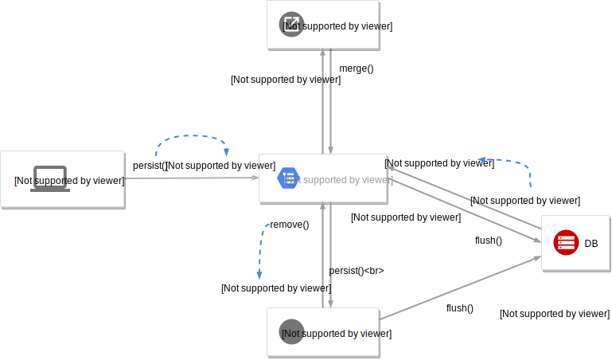

# 컬렉션과 부가 기능

## 1. 컬렉션
`Collection` 자바가 제공하는 최상위 컬렉션. 중복 허용, 순서 보장 안한다고 가정 한대요.  
`Set` 중복 허용 안하고, 순서 보장을 안한대요.
`List` 중복을 허용하고, 순서를 보장하죠.
`Map` key, value 쌍으로 구성된 특별한 컬렉션 이라죠.
> `Map` 은 `@MapKey*` 어노테이션으로 매핑 할 수 있는데, 복잡한 매핑에 비해 활용도가 떨어져서 책에서 생략한다고 ...

### 1.1 JPA와 컬렉션
하이버네이트는 엔티티를 영속 상태로 만들 때, 컬렉션으로 된 필드는 자체적인 랩퍼 클래스를 사용한대요. `org.hibernate.collection.internal.PersistentBag` 같은 객체로요.
그래서 컬렉션을 사용할 때,
```java
Collection<Member> members = new ArrayList<Member>();
```
이렇게 선언하면서 즉시 초기화해서 사용하길 권장한대요.

컬렉션 별로 하이버네이트 자체 랩퍼 클래스와 특징을 보면


| 컬렉션 인터페이스           | Wrapper        |  중복   |  순서   |
| :------------------ | :------------- | :---: | :---: |
| Collection, List    | PersistenceBag |   O   |   X   |
| Set                 | PersistenceSet |   X   |   X   |
| List + @OrderColumn | PersistentList |   O   |   O   |

### 1.2 Collection, List
이들은 중복을 허용하죠. PersistenctBag 래퍼가 사용되고.
`.remove(Object)` 이나 `.contains(Object)` 를 하면 `.equals(Object)` 만 사용하고,  
`.add(Object)` 할 때는 비교없이 결과는 `true` 를 반환 한대요.  
따라서, **`Collection` 과 `List`  는 엔티티를 추가할 때 중복 확인을 안하고 저장** 만 하고,  
**엔티티를 추가해도 지연 로딩된 필드를 초기화 하지 않는다** 고 하네요.

### 1.3 Set
중복을 허용하지 않고, `PersistentSet` 을 컬렉션 래퍼로 쓰는 아이입니다.  
중복을 허용하지 않기 때문에 `.add(Object)` 를 실행하면 `.equals(Object)` 와 `.hashCode()` 로 비교를 한다고 해요. `hashCode()` 를 Override 해야겠네요.  
결과적으로 **`Set` 중복 엔티티를 확인** 하니까, **엔티티 추가할 때 지연 로딩된 컬렉션을 초기화 한다** 고 하는 군요.

### 1.4 List + @OrderColumn
`@OrderColumn` 은 **DB에 순서 값을 저장**해서, **조회할 때 사용** 한다는 의미래요. `PersistentList` 를 사용하고요.
```java
@Entity
class Board {
  ...
  @OneToMany(mappedBy = "board")
  @OrderColumn(name = "POSITION")
  private List<Comment> comments = new ArrayList<>();
  ...
}
```
```java
@Entity
class Comment {
  ...
  @ManyToOne
  @JoinColumn(name = "BOARD_ID")
  private Board board;
  ...
}
```
이런 엔티티 구성에서 `Board.comments` 는 순서가 있는 컬렉션으로 인식이 되겠네요.

**순서가 있는 컬렉션은 DB에 순서 값도 함께 관리** 되어야 한대요.  
`@OrderColumn(name = "POSITION")` 에서 `name` 속성의 `POSITION` 이라는 컬럼이 정렬 순서 값을 가진다는 의미인데...
사실, 몇가지 단점으로 `@OrderColumn` 은 잘 안쓴다고 하는군요.

1. `@OrderColumn` 은 `Board` 엔티티에 정의 되는데 `Comment` 엔티티에 'POSITION' 컬럼이 설정되면서, 정작 `Comment` 엔티티가 순서를 몰라 UPDATE 하는 SQL 이 추가로 발생하고,
2. 예를들어, 4개의 item이 있는데 2번째 item이 삭제되면 3,4번째 아이템의 순번을 낮추는 SQL이 실행되고,
3. 강제로(직접 SQL 호출 등) `POSITION` 값을 변경하거나 중간번호를 삭제하면 `[0, null, 2, 3]` 로 조회가 돼 NPE가 발생한대요.

### 1.5 @OrderBy
단점이 많은 `@OrderColumn` 이 순서를 저장하는 컬럼을 이용했다면, `@OrderBy` 는 SQL의 `ORDER BY` 구문을 이용한대요.
```java
@Entity
class Team {
  ...
  @OneToMany(mappedBy = "team")
  @OrderBy("username desc, id asc")
  private Set<Member> members = new HashSet<Member>();
  ...
}
```
```java
@Entity
class Member {
  ...
  @ManyToOne
  private Team team;
}
```
**엔티티의 필드를 대상**으로 정렬을 하니까 특별히 복잡할 것도 없군요.
> 예제가 `Set` 을 쓰면서 정렬을 했네요. 분명히 순서가 보장되지 않는다고 했는데...  
> 하이버네이트가 내부적으로 `HashSet` 이 아닌 `LinkedHashSet` 으로 구현체를 바꿔서 순서를 유지해준다고 해요. 똑똑하네요.

## 2. @Converter
엔티티의 데이터를 변환해서 DB에 저장 하고, 반대로 조회한 데이터를 변형해서 엔티티에 담을 수 있는 기능이래요.

예를들어, VIP 회원을 `private boolean vip;` 로 엔티티는 정의하지만 DB는 `VIP VARCHAR(1) DEFAULT 'N'` 이어서 "Y","N" 으로 사용되는 경우에 활용되겠네요.

```java
@Entity
class Member {
  ...
  @Convert(converter = BooleanToYNConverter.class)
  private boolean vip;
  ...
}
```
```java
@Converter
public class BooleanToYNConverter implements AttributeConverter<Boolean, String> {
  public String convertToDatabaseColumn(Boolean attribute) {
    return attribute != null && attribute ? "Y" : "N";
  }

  public Boolean convertToEntityAttribute(String dbData) {
    return "Y".equals(dbData);
  }
}
```
이렇게 사용하면 된대요.
```java
@Entity
@Convert(converter = BooleanToYNConvert.class, attributeName = "vip")
class Member ...
```
클래스 레벨에 정의 할 수도 있다고 해요. boolean 타입이 여러개 일 경우에 한꺼번에 쓸 수도 있겠네요.

### 2.1 글로벌 설정
```java
@Converter(autoApply = true)
public class BooleanToYNConverter ...
```
`autoApply` 속성을 `true` 로 설정하면, 모든 엔티티의 Boolean 타입에 컨버터가 적용 된다고 하네요.

```java
   ...
  @Convert(disableConversion = true)
  private boolean vip;
  ...
}
```
`disableConversion` 속성의 기본값으 `false` 인데, 이걸 `true` 로 설정하면 글로벌 컨버터나 클래스 레벨등의 상속받은 컨버터를 사용하지 않게 한대요.

## 3. 리스너
엔티티의 기능 실행에 따라 발생하는 이벤트를 처리 하는 걸 얘기하네요.

### 3.1 이벤트 종류


1. **PostLoad** 엔티티가 영속성 컨텍스트에 조회된 직후 또는 `refresh` 를 호출한 후(2차 캐시에 있어도 호출 됨)
2. **PrePersist** `persist()` 메소드를 호출해서 엔티티를 영속성 컨텍스트에 관리하기 직전 호출. 새로운 인스턴스를 `merge` 할 때도 수행
3. **PreUpdate** `flush` 나 `commit` 을 호출해서 엔티티를 DB에 반영 직전 호출
4. **PreRemove** `remove()` 메소드를 호출해서 엔티티를 영속성 컨텍스트에서 삭제하기 직전에 호출. `CascadeType.REMOVE` 로 설정돼 영속성 전이가 일어날 때도 호출. `orphanRemoval` 에 대해서는 `flush` 나 `commit` 시에 호출
5. **PostPersist** `flush` 나 `commit` 을 호출해서 엔티티를 DB에 저장한 직후에 호출
6. **PostUpdate** `flush` 나 `commit` 을 호출해서 엔티티를 DB에 수정한 직후에 호출
7. **PostRemove** `flush` 나 `commit` 을 호출해서 엔티티를 DB에 삭제한 직후 호출

### 3.2 이벤트 적용 위치
- 엔티티에 직접 적용하거나,
- 별도의 리스너를 등록하거나,
- 기본 리스너 사용

해서 적용 한대요.

#### 엔티티에 직접 적용
```java
@Entity
class Duck {
  @Id @GeneratedValue
  public Long id;

  private String name;

  @PrePersist
  public void prePersist() {
    System.out.println("Duck.prePersist id: " + id);
  }

  ...
}
```

#### 별도의 리스너 등록
```java
@Entity
@EntityListener(DuckListener.class)
class Duck {
  ...
}
```
```java
class DuckListener {
  @PrePersist
  private void prePersist(Object obj) {
    System.out.println(obj);
  }

  ...
}
```
이벤트를 핸들링하는 메소드는 리턴 타입이 `void` 여야한대요. 그리고 파라미터로는 대상 엔티티 객체를 받는다고 합니다.

#### 기본 리스터 사용
모든 엔티티에 적용할 수 있는 방법이래요. `META-INF/orm.xml` 파일에 등록하고요.
```XML
<entity-mapping ...>
  <persistence-unit-metadata>
    <persistence-unit-defaults>
      <entity-listeners>
        <entity-listener class="jpashop.domain.listener.DefaultListener" />
      </entity-listeners>
    </persistence-unit-defaults>
  </persistence-unit-metadata>
</entity-mapping>
```


다양한 방법으로 리스너를 등록 할 수 있네요. 따라서 적용되는 순서도 있겠죠?

1. 기본 리스터
2. 부모(상속) 클래스 리스터 
3. @EntityListeners
4. 엔티티 내부에 메소드로 정의된 리스너

이런 순서로 호출 된대요. 그리고 만약 기본 리스너를 무시하고 싶다면 엔티티를 정의하는 클래스에 `@ExcludeDefaultListeners` 를.  
상위 클래스 이벤트 리스너를 무시하고하고 싶다면 `@ExcludeSuperclassListeners` 를 정의해주면 된다고 합니다.

## 4. 엔티티 그래프
**엔티티 그래프 기능은 엔티티 조회시점에 연관된 엔티티들도 함께 조회하는 것** 이라고 하는군요. JPA 2.1 명세에 추가된 내용이고요.

연관 엔티티를 함께 조회하려면,
```java
@Entity
class Order {
  @ManyToOne(fetch = FetchType.EAGER)
  private Member member;
}
```
이렇게 `FetchType.EAGER` 를 주던가
```SQL
  SELECT o
    FROM Order o
    JOIN FETCH o.member
```
이렇게 `JOIN FETCH` 를 사용하는거죠.  
그런데 `FetchType.EAGER` 는 최적화의 문제가 있을 수 있고, 패치 조인의 경우는 JPQL을 중복 작성하는 경우가 많대요.

주문을 조회할 때
```SQL
  SELECT o
    FROM Order
   WHERE o.status = ?
```
그러다 주문과 회원이 함께 필요하면
```SQL
  SELECT o
    FROM Order
    JOIN FETCH o.member
   WHERE o.status = ?
```
그리고 주문과 상품을 같이 조회하려면
```SQL
  SELECT o
    FROM Order
    JOIN FETCH o.orderItems
   WHERE o.status = ?
```
이처럼 연관 엔티티에 따라서 비슷한 듯, 다른 JPQL이 필요하고 각각을 조회하면서 같은 `Order` 엔티티는 계속 조회 되겠네요.

이럴 때가 **엔티티 그래프 기능**이 필요한 때!

### 4.1 Named 엔티티 그래프
```java
@NamedEntityGraph(
  name = "Order.withMember",
  attributeNodes = {
    @NamedAttributeNode("member")
  }
)
@Entity
class Order {
  ...
  @ManyToOne(fetch = FetchType.LAZY, optional = false)
  @JoinColumn(name = "MEMBER_ID")
  private Member member;
  ...
}
```
`FetchType.LAZY` 로 되어 있지만 엔티티 그래프 기능으로 조회하면 `Order` 와 `Member` 가 같이 조회된다고 해요.

### 4.2 `em.find()` 에서 엔티티 그래프 사용
```java
EntityGraph graph = em.getEntityGraph("Order.withMember");

Map<String, Object> hints = new HashMap<>();
hints.put("javax.persistence.fetchgraph", graph);

Order order = em.find(Order.class, orderId, hints);
```
이렇게 실행하게 되면,
```SQL
      SELECT o.*,
             m.*
        FROM Orders o
  INNER JOIN Member m
          ON o.MEMBER_ID = m.MEMBER_ID
       WHERE o.ORDER_ID = ?
```
이런 SQL이 실행된다고 합니다.

### 4.3 subgraph
`Order` > `OrderItem` > `Item` 까지 연관 관계 속의 연관 관계까지 조회할 땐, `subgraph` 를 쓴대요.
```java
@NamedEntityGraph(
  name = "Order.withAll",
  attributeNodes = {
    @NamedAttributeNode("member"),
    @NamedAttributeNode(
      value = "orderItems",
      subgraph = "orderItems"
    ),
    subgraphs = @NamedSubgraph(
      name = "orderItems",
      attributeNodes = {
        @NamedAttributeNode("item")
      }
    )
  }
)
@Entity
class Order {
  ...
  @ManyToOne(fetch = FetchType.LAZY, optional = false)
  @JoinColumn(name = "MEMBER_ID")
  private Member member;

  @OneToMany(mappedBy = "order", cascade = CascadeType.ALL)
  private List<OrderItem> orderItems = new ArrayList<>();
  ...
}
```
```java
@Entity
class OrderItem {
  ...
  @ManyToOne(fetch = FetchType.LAZY)
  @JoinColumn(name = "ITEM_ID")
  private Item item;
  ...
}
```
생각보다 복잡한데... 이거 써먹을 수 있을 까요?
```java
Map<String, Object> hints = new HashMap<>(1);
hints.put("javax.persistence.fetchgraph", em.getEntityGraph("Order.withAll"));

Order odrer = em.find(ORder.class, orderId, hints);
```
조회하면 잘 된다고 합니다.

### 4.4 JPQL에서 엔티티 그래프 사용
JPQL 로도 쓸 수 있다는 것 말고는... 어노테이션 지옥에서 해방 될 수 없다...
```java
List<Order> results =
  em.createQuery("SELECT o FROM Order o WHERE o.id = :orderId", ORder.class)
    .setParameter("orderId", orderId)
    .setHint("javax.persistence.fetchgraph", em.getEntityGraph("Order.withAll"))
    .getResultList();
```

> `Order.member` 는 `optional = false` 속성으로 필수 관계로 되어있네요.
> `em.find()` 에서 엔티티 그래프를 사용하면 하이버네이트는 필수 관계를 고려해서 SQL 내부 조인을 사용하지만 JPQL에서 엔티티 그래프를 사용할 때는 항상 SQL 외부 조인을 사용한대요. 만약 SQL 내부 조인을 사용하려면 다음처럼 내부 조인을 명시 하래요.  
> `SELECT o FROM Order o JOIN FETCH o.member WHERE o.id = :orderId`

### 4.5 동적 엔티티 그래프
엔티티 그래프를 동적으로 구성하려면 `createEntityGraph()` 를 사용하면 된대요. (어노테이션 지옥에서 해방 될 수 있는 방법인가 싶어 기대해봅니다.)
```java
EntityGraph<Order> graph = em.createEntityGraph(Order.class);
graph.addAttributeNodes("member");

Map<String, Object> hints = new HashMap<>();
hints.put("javax.persistence.fetchgraph", graph);

Order order = em.find(Order.class, orderId, hints);
```
이정도면 어노테이션보다 나아 보이는 걸까요?  
더 복잡한 subgraph 기능을 도엊ㄱ으로 구성해 봐야 알겠네요.
```java
EntityGraph<Order> graph = em.createEntityGraph(Order.class);
graph.addAttributeNodes("member");
Subgraph<OrderItem> orderItems = graph.addSubgraph("orderItems");
orderItems.addAttributeNodes("item");

Map<String, Object> hints = new HashMap<>();
hints.put("javax.persistence.fetchgraph", graph);

Order order = em.find(Order.class, orderId, hints);
```
그냥 복잡한 건 어쩔 수 없나봐요.

### 4.6 엔티티 그래프 정리
- **ROOT 에서 시작**  
  당연하게도 `Order` 를 조회하는데 `Member` 부터 시작하는 건 아니라고...
- **이미 로딩된 엔티티**  
  ```java
  Order order1 = em.find(Order.class, 1L); // 1L 조회

  hints.put("javax.persistence.fetchgraph", em.getEntityGraph("Order.withMember"));

  Order order2 = em.find(Order.class, 1L, hints);
  ```
  이러면 `order2` 는 조회가 되질 않고, `order1` 과 같은 아이가 할당된다고 하네요.
- **fetchgraph 그리고 loadgraph 의 차이**  
  힌트중에 `javax.persistence.loadgraph` 도 있는데, 엔티티 그래프에 정의된 아이들 말고 `FetchType.EAGER` 로 설정된 연관 관계들 까지 포함해서 조회 하는 거라는 군요.
  > `하이버네이트 4.3.10.Final` 버전에서는 `em.find()` 는 정상인데, JPQL은 fetchgraph 와 loadgraph 가 동일하게 동작한다고... ~~그냥 다른 버전 쓰는게...~~
  